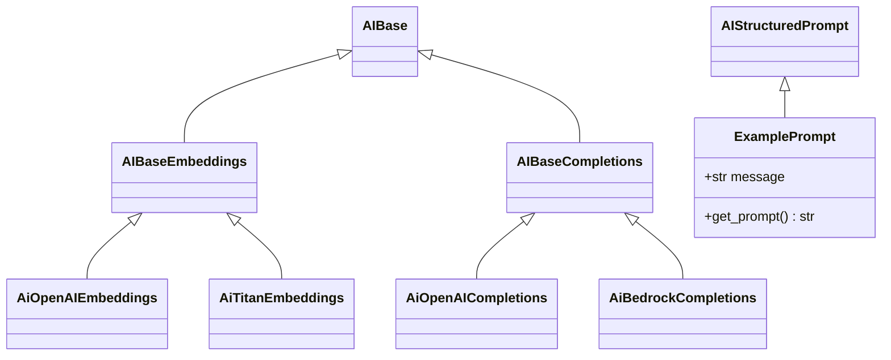

# ai_api Unifying Foundation Model APIs

This repository contains a Python package that aims to provide a unified
interface for working with different foundation model providers. The
included code defines abstract base classes and a factory for creating
client instances for completion and embedding APIs.

The repository already includes example implementations for both
OpenAI and Amazon Bedrock/Titan. Environment configuration is handled
through a small `EnvSettings` class powered by Pydantic.

## Repository layout

```
src/ai_api/        - package source code
src/ai_api/ai_base.py      - abstract interfaces
src/ai_api/ai_factory.py   - factory for selecting client implementations
```

## Class hierarchy



## Installing

The project is managed with [Poetry](https://python-poetry.org/) and requires
Python 3.9 or later. After cloning the repository install Poetry and run:

```bash
poetry install
```

This creates a virtual environment with all dependencies as defined in the
`pyproject.toml`.  While developing you can install the project in editable mode
with:

```bash
poetry install --with dev
```

Copy `env_template` to `.env` and fill in your credentials before running the
examples.

To verify your environment run the unit tests:

```bash
poetry run pytest
```

## Publishing with Poetry

The package can be built and uploaded to a private JFrog Artifactory PyPI
repository.  Replace `myrepo` and the URL with the appropriate values for your
organization.

```bash
# Build the wheel and source distribution
poetry build

# Configure the JFrog repository
poetry config repositories.myrepo https://<your-jfrog-url>/artifactory/api/pypi/pypi-local

# Optional: store credentials (or use environment variables)
poetry config http-basic.myrepo <username> <password>

# Publish the package
poetry publish -r myrepo
```

The same steps can be used for any other internal or public index.

## TODO

1. Publish the package to your internal or public package index.
2. Add more usage examples and provider implementations as needed.
3. Improve documentation and type hints.

Once these items are completed the project can be built and uploaded using
`pip wheel .` followed by your organization's upload process.
