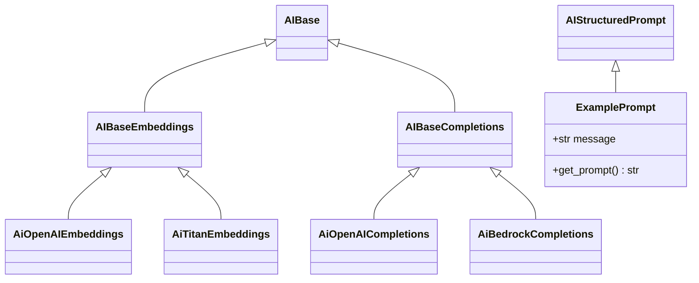

# ai_api Unifying Foundation Model APIs

This repository contains a Python package that aims to provide a unified
interface for working with different foundation model providers. The
included code defines abstract base classes and a factory for creating
client instances for completion and embedding APIs.

The repository already includes example implementations for both
OpenAI and Amazon Bedrock/Titan. Environment configuration is handled
through a small `EnvSettings` class powered by Pydantic.

## Repository layout

```
src/ai_api/        - package source code
src/ai_api/ai_base.py      - abstract interfaces
src/ai_api/ai_factory.py   - factory for selecting client implementations
```

## Class hierarchy



## Installing

This project uses a standard `pyproject.toml` and can be installed in
editable mode while developing:

```bash
pip install -e .
```

Copy `env_template` to `.env` and fill in your credentials before running the examples.

Running the unit tests requires `pytest`:

```bash
pytest
```

## TODO

1. Publish the package to your internal or public package index.
2. Add more usage examples and provider implementations as needed.
3. Improve documentation and type hints.

Once these items are completed the project can be built and uploaded using
`pip wheel .` followed by your organization's upload process.
