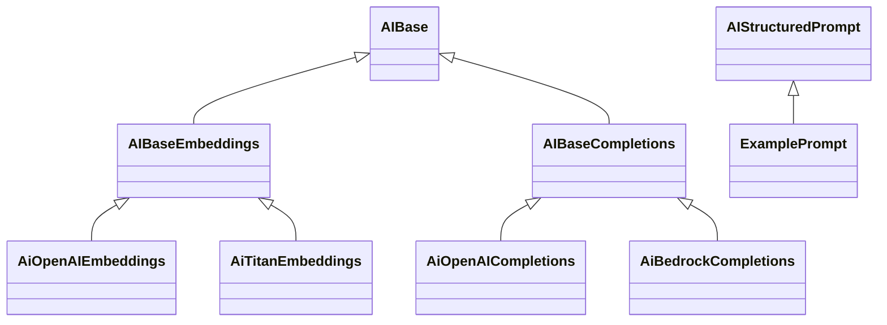

# ai-api

This repository contains a Python package that aims to provide a unified
interface for working with different foundation model providers.  The
included code defines abstract base classes and a factory for creating
client instances for completion and embedding APIs.

The repository already includes working implementations for both
OpenAI and Amazon Bedrock/Titan. Environment configuration is handled
through a small `EnvSettings` class powered by Pydantic.

## Repository layout

```
src/ai_api/        - package source code
src/ai_api/ai_base.py      - abstract interfaces
src/ai_api/ai_factory.py   - factory for selecting client implementations
```



```python
from ai_api.ai_base import AIStructuredPrompt

class ExamplePrompt(AIStructuredPrompt):
    text: str

    @staticmethod
    def get_prompt() -> str:
        return "Reply with a JSON object containing a 'text' field."
```

## Installing

This project uses a standard `pyproject.toml` and can be installed in
editable mode while developing:

```bash
pip install -e .
```

Copy `env_template` to `.env` and fill in your credentials before running the examples.

Running the unit tests requires `pytest`:

```bash
pytest
```

## TODO / things to fix

1. Expand unit tests to cover both OpenAI and Bedrock when credentials are available.
2. Add more structured prompt examples and usage instructions.
3. Document the steps for publishing a wheel to your JFrog Artifactory.
4. Review pricing and context window tables for accuracy as models evolve.

After completing these tasks, build the project using `pip wheel .` and upload
the resulting artifact using your organization's deployment workflow.
