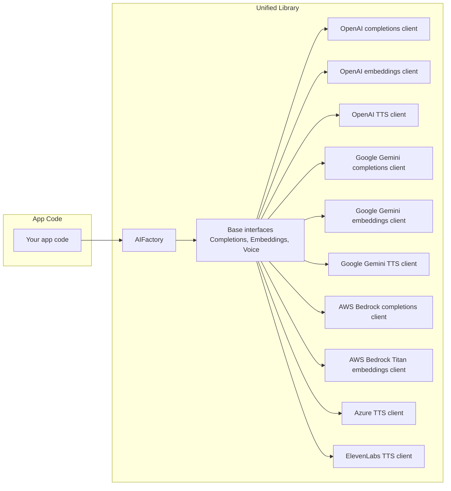

# ai-api-unified - a Vendor-Agnostic AI Services Library

> Latest version: 0.14.6

`ai-api-unified` is a unified, typed client for **Completions**, **Embeddings**, and **Voice** that lets you switch providers by **changing configuration, not code**. Your app targets stable base interfaces; factories select concrete providers at runtime based on environment variables. This keeps call sites clean and makes vendor swaps low-risk.

> **Key idea:** Write to the **base interfaces** (completions, embeddings, voice). Change the provider via **env/config** only.

---

## Model Categories & Capability Matrix

| Category    | Base Interface             | Providers (examples)                                       | Required Poetry extra(s)                                                                  |
| ----------- | -------------------------- | ---------------------------------------------------------- | ----------------------------------------------------------------------------------------- |
| Completions | `AIBaseCompletions`        | **OpenAI**, AWS Bedrock (Nova), Google Gemini              | OpenAI: _none_; Bedrock: `bedrock`; Gemini: `google_gemini`                               |
| Embeddings  | `AIBaseEmbeddings`         | **OpenAI**, Amazon Titan, Google Gemini                    | OpenAI: _none_; Titan: `bedrock`; Gemini: `google_gemini`                                 |
| Voice TTS   | `AIVoiceBase`              | OpenAI, Google Vertex AI Gemini TTS, Azure TTS, ElevenLabs | Google: `google_gemini` (Vertex Gemini SDK); Azure: `azure_tts`; ElevenLabs: `elevenlabs` |
| Voice STT   | `AIVoiceBase` (if enabled) | Google (and others if configured)                          | Typically `google_gemini`                                                                 |

> Only **OpenAI** works with the base package alone. **All other providers require the appropriate Poetry extra(s).**
> Install extras with:
> `poetry add 'ai-api-unified[<extra name>]'`

---

## Table of Contents

1. [Supported Providers & Models](#supported-providers--models)
2. [Installation](#installation)
   2.1. [Python & System Requirements](#python--system-requirements)
   2.2. Install (Poetry)
   2.3. [Choose Provider Extras](#choose-provider-extras)
   2.4. [Smoke Test](#smoke-test)
3. [Quickstart: Factory → Client → Use It](#quickstart-factory--client--use-it)
   3.1. [Completions](#completions)
   3.2. [Embeddings](#embeddings)
   3.3. [Voice TTS](#voice-tts)
4. [Configuration & Environment Variables](#configuration--environment-variables)
   4.1. [Global Selectors](#global-selectors)
   4.2. [Provider-Specific Variables](#provider-specific-variables)
   4.3. [Geo-restricted Data Residency](#geo-restricted-data-residency)
5. [Vendor Setup Guides](#vendor-setup-guides)
   5.1. [OpenAI](#openai)
   5.2. [AWS Bedrock & Amazon Titan](#aws-bedrock--amazon-titan)
   5.3. [Google Gemini](#google-gemini)
   5.4. [Azure Cognitive Services TTS](#azure-cognitive-services-tts)
   5.5. [ElevenLabs](#elevenlabs)
6. [API Programming Guide](#api-programming-guide)
   6.1. [Factories & Clients](#factories--clients)
   6.2. [Completions API](#completions-api)
   6.3. [Embeddings API](#embeddings-api)
   6.4. [Voice API](#voice-api)
   6.5. [Structured Prompts](#structured-prompts)
   6.6. [Token Counting & Cost Hints](#token-counting--cost-hints)
7. [Advanced Topics](#advanced-topics)
   7.1. [Retries & Backoff](#retries--backoff)
8. [Class Flow Diagram](#class-flow-diagram)
9. [Repository Layout, Tests, Examples](#repository-layout-tests-examples)
10. [Troubleshooting](#troubleshooting)
11. [Versioning & License](#versioning--license)

---

## Supported Providers & Models

- **OpenAI**

  - Completions: current GPT-4.x / 4o family
  - Embeddings: `text-embedding-3-small` / `-large`
  - Voice: OpenAI TTS

- **AWS Bedrock & Amazon Titan**

  - Completions: Nova family (and other Bedrock models configured in your env)
  - Embeddings: Titan (`amazon.titan-embed-text-v2:0`, etc.)

- **Google Gemini**

  - Completions: Gemini 1.5 / 2.x family
  - Embeddings: `gemini-embedding-001`
  - Voice: Google Cloud Text-to-Speech

- **Azure Cognitive Services** (TTS)
- **ElevenLabs** (TTS)

> Exact model names are selected by env variables in this library; see **Configuration** and **Vendor Guides**.

---

## Installation

### Python & System Requirements

Use a supported Python version per your project settings. If deploying to AWS Lambda, consult **Troubleshooting** for wheel guidance.

### Choose Provider Extras

**OpenAI only:** > `poetry add 'ai-api-unified'`

**Google Gemini (completions or embeddings, and Google TTS/STT):** > `poetry add 'ai-api-unified[google_gemini]'`

**AWS Bedrock (Nova) and Amazon Titan (embeddings):** > `poetry add 'ai-api-unified[bedrock]'`

**Azure TTS:** > `poetry add 'ai-api-unified[azure_tts]'`

**ElevenLabs TTS:** > `poetry add 'ai-api-unified[elevenlabs]'`

**Optional similarity helpers (NumPy, etc.):** > `poetry add 'ai-api-unified[similarity_score]'`

**Multiple extras:**
`poetry add 'ai-api-unified[bedrock,google_gemini]'`

**Why:** non-OpenAI providers ship heavier SDKs; extras keep default installs slim.

### Smoke Test

```bash
python -c "import ai_api_unified as m; print('ok')"
```

**Why:** quick import check to confirm resolver and credentials are correct.

---

## Quickstart: Factory → Client → Use It

Set the **global selectors** and **provider credentials** before running the examples. All required env vars are shown above each snippet.

### Completions

```python
# Required env (OpenAI):
#   COMPLETIONS_ENGINE=openai
#   OPENAI_API_KEY=...
# Optional:
#   COMPLETIONS_MODEL_NAME=gpt-4o-mini

from ai_api_unified.ai_factory import AIFactory
from ai_api_unified.ai_base import AIBaseCompletions

client: AIBaseCompletions = AIFactory.get_ai_completions_client()
text: str = client.send_prompt("Say hello in one short sentence.")
print(text)
```

**What it does and why:** obtains a provider-selected completions client using env settings; your code speaks only the base interface, so vendor swaps require **no code changes**.

### Embeddings

```python
# Required env (OpenAI example):
#   EMBEDDING_ENGINE=openai
#   OPENAI_API_KEY=...
# Optional:
#   EMBEDDING_MODEL_NAME=text-embedding-3-small
#   EMBEDDING_DIMENSIONS=1536

from ai_api_unified.ai_factory import AIFactory
from ai_api_unified.ai_base import AIBaseEmbeddings

emb: AIBaseEmbeddings = AIFactory.get_ai_embedding_client()
res: dict[str, object] = emb.generate_embeddings("hello world")
vector = res.get("embedding")
print(len(vector) if vector else None)
```

**What it does and why:** generates a vector under a stable key suitable for storage or downstream retrieval. Dimensions and model are env-configurable.

### Voice TTS

```python
# Example using Google TTS:
#   poetry add 'ai-api-unified[google_gemini]'
# Required env:
#   AI_VOICE_ENGINE=google
#   GOOGLE_APPLICATION_CREDENTIALS=/path/to/service_account.json
#   GOOGLE_PROJECT_ID=<gcp-project-id>
# Optional:
#   GOOGLE_LOCATION=us-central1
#   AI_VOICE_LANGUAGE=en-US

from ai_api_unified.ai_voice_factory import AIVoiceFactory
from ai_api_unified.ai_voice_base import AIVoiceBase

voice: AIVoiceBase = AIVoiceFactory.get_voice_client()
audio_bytes: bytes = voice.text_to_speech("Hello from a unified voice API")
with open("out.wav", "wb") as f:
    f.write(audio_bytes)
# or
voice.play(audio_bytes)
```

**What it does and why:** selects the configured voice engine and synthesizes audio. SDKs load only when the engine is selected.

---

## Configuration & Environment Variables

### Global Selectors

These choose the **provider** for each category:

- `COMPLETIONS_ENGINE` = `openai` | `nova` | `google-gemini`
- `EMBEDDING_ENGINE` = `openai` | `titan` | `google-gemini`
- `AI_VOICE_ENGINE` = `openai` | `google` | `azure` | `elevenlabs`

Common optional knobs:

- `COMPLETIONS_MODEL_NAME` (e.g., `gpt-4o-mini`, `gemini-2.0-flash-lite`, `amazon.nova-lite-v1:0`)
- `EMBEDDING_MODEL_NAME` (e.g., `text-embedding-3-small`, `amazon.titan-embed-text-v2:0`, `gemini-embedding-001`)
- `EMBEDDING_DIMENSIONS` (provider-specific defaults, e.g., 1536 for OpenAI text-embedding-3-small)

### Provider-Specific Variables

**OpenAI (no extra needed)**

- `OPENAI_API_KEY`
- Optional: `COMPLETIONS_MODEL_NAME`, `EMBEDDING_MODEL_NAME`, `EMBEDDING_DIMENSIONS`

**AWS Bedrock & Amazon Titan** _(requires extra: `bedrock`)_

- `AWS_REGION` (e.g., `us-east-1`)
- Optional: `COMPLETIONS_MODEL_NAME` (Nova), `EMBEDDING_MODEL_NAME` (Titan), `EMBEDDING_DIMENSIONS`

**Google Gemini** _(requires extra: `google_gemini`)_

- `GOOGLE_APPLICATION_CREDENTIALS` (path to service account JSON)
- Optional: `GOOGLE_PROJECT_ID`, `GOOGLE_LOCATION`
- Optional: `COMPLETIONS_MODEL_NAME`, `EMBEDDING_MODEL_NAME`, `EMBEDDING_DIMENSIONS`

**Azure Cognitive Services TTS** _(requires extra: `azure_tts`)_

- `MICROSOFT_COGNITIVE_SERVICES_API_KEY`
- `MICROSOFT_COGNITIVE_SERVICES_REGION`
- Optional: `MICROSOFT_COGNITIVE_SERVICES_ENDPOINT`, `AI_VOICE_LANGUAGE`

**ElevenLabs TTS** _(requires extra: `elevenlabs`)_

- `ELEVEN_LABS_API_KEY`
- Optional: voice selection variables used by your implementation

**Voice (common option)**

- `AI_VOICE_LANGUAGE` (e.g., `en-US`)

### Geo-restricted Data Residency

If your deployment must keep data in the U.S., set:

- `AI_API_GEO_RESIDENCY=US` (or `USA` / `United States`)

Providers that support regional endpoints will route via U.S. URLs when this is set; others may log a warning if the SDK does not expose regional control.

---

## Vendor Setup Guides

### OpenAI

**Install:**
`poetry add 'ai-api-unified'`

**Env:**

```
COMPLETIONS_ENGINE=openai
EMBEDDING_ENGINE=openai
OPENAI_API_KEY=...
# Optional:
COMPLETIONS_MODEL_NAME=gpt-4o-mini
EMBEDDING_MODEL_NAME=text-embedding-3-small
EMBEDDING_DIMENSIONS=1536
AI_API_GEO_RESIDENCY=US   # optional
```

**Sanity check:**

```python
from ai_api_unified.ai_factory import AIFactory
c = AIFactory.get_ai_completions_client()
print(c.send_prompt("Ping"))
```

**Why:** verifies key wiring and model selection.

---

### AWS Bedrock & Amazon Titan

**Install:**
`poetry add 'ai-api-unified[bedrock]'`

**Env:**

```
COMPLETIONS_ENGINE=nova
EMBEDDING_ENGINE=titan
AWS_REGION=us-east-1
AWS_ACCESS_KEY_ID=...
AWS_SECRET_ACCESS_KEY=...
# Optional if using temporary creds:
AWS_SESSION_TOKEN=...
# Optional:
COMPLETIONS_MODEL_NAME=amazon.nova-lite-v1:0
EMBEDDING_MODEL_NAME=amazon.titan-embed-text-v2:0
EMBEDDING_DIMENSIONS=1024
AI_API_GEO_RESIDENCY=US   # optional
```

**Sanity check:**

```python
from ai_api_unified.ai_factory import AIFactory
c = AIFactory.get_ai_completions_client()
print(c.send_prompt("Ping from Bedrock"))
```

**Why:** confirms region and IAM credentials are valid.

---

### Google Gemini

**Install:**
`poetry add 'ai-api-unified[google_gemini]'`

**Env:**

```
COMPLETIONS_ENGINE=google-gemini
EMBEDDING_ENGINE=google-gemini
GOOGLE_APPLICATION_CREDENTIALS=/path/service_account.json
# Optional:
GOOGLE_PROJECT_ID=...
GOOGLE_LOCATION=us-central1
COMPLETIONS_MODEL_NAME=gemini-2.0-flash-lite
EMBEDDING_MODEL_NAME=gemini-embedding-001
EMBEDDING_DIMENSIONS=3072
AI_API_GEO_RESIDENCY=US   # optional; may log warning if SDK lacks regional control
```

**Sanity check:**

```python
from ai_api_unified.ai_factory import AIFactory
c = AIFactory.get_ai_completions_client()
print(c.send_prompt("Ping from Gemini"))
```

**Why:** verifies service account auth and model selection.

---

### Azure Cognitive Services TTS

**Install:**
`poetry add 'ai-api-unified[azure_tts]'`

**Env:**

```
AI_VOICE_ENGINE=azure
MICROSOFT_COGNITIVE_SERVICES_API_KEY=...
MICROSOFT_COGNITIVE_SERVICES_REGION=...
# Optional:
MICROSOFT_COGNITIVE_SERVICES_ENDPOINT=...
AI_VOICE_LANGUAGE=en-US
```

**Sanity check:**

```python
from ai_api_unified.ai_voice_factory import AIVoiceFactory
v = AIVoiceFactory.get_voice_client()
open("azure.wav","wb").write(v.text_to_speech("Azure TTS ready"))
```

**Why:** synthesizes a short WAV to confirm credentials and region.

---

### ElevenLabs

**Install:**
`poetry add 'ai-api-unified[elevenlabs]'`

**Env:**

```
AI_VOICE_ENGINE=elevenlabs
ELEVEN_LABS_API_KEY=...
# Optional: voice selection variables if supported
```

**Sanity check:**

```python
from ai_api_unified.ai_voice_factory import AIVoiceFactory
v = AIVoiceFactory.get_voice_client()
open("11labs.wav","wb").write(v.text_to_speech("Testing ElevenLabs"))
```

**Why:** produces short audio to verify API key wiring.

---

## API Programming Guide

**Design principle:** your code targets the **base interfaces**. Factories return provider-specific implementations based on env/config.

### Factories & Clients

Typical entry points (check your code for the authoritative signatures):

```python
from ai_api_unified.ai_factory import AIFactory
from ai_api_unified.ai_base import AIBaseCompletions, AIBaseEmbeddings

completions_client: AIBaseCompletions = AIFactory.get_ai_completions_client()
embedding_client:  AIBaseEmbeddings  = AIFactory.get_ai_embedding_client()
```

**Why:** centralizes provider selection and keeps your business logic provider-agnostic.

### Completions API

Common methods exposed by the base layer:

- `send_prompt(prompt: str, *, other_params: AICompletionsPromptParamsBase | None = None) -> str`
- `strict_schema_prompt(prompt: str, response_model: type[AIStructuredPrompt], max_response_tokens: int = 512, *, other_params: AICompletionsPromptParamsBase | None = None) -> AIStructuredPrompt`

**Free-form example:**

```python
resp: str = comp.send_prompt("Say hello in Spanish.")
print(resp)
```

**Why:** simplest way to get text output across providers.

Got it. Here’s a crisp, library-specific description that matches your code and explains the _point_ of the feature without fluff.

# Structured Prompting (Schema-validated)

**What it is:**
A way to turn an LLM call into a **typed function**: you declare the expected output as a Pydantic model (subclassing `AIStructuredPrompt`), and the library enforces that the model returned by the LLM **conforms to your JSON schema** before you ever touch the data.

**Why it exists:**

- You get a **strong contract** for LLM outputs (types + required fields).
- Your prompt logic, output schema, and runtime call live in **one place** you can unit-test.
- It’s **provider-agnostic**: the same pattern works no matter which completions engine you select via env/config.

**Creating a structured prompt, a Tutorial:**

1. **Define a structured prompt type**
   Example: `NameAgeCityStructuredPrompt(AIStructuredPrompt)` with:

   - **Input field**: `input_text` (the raw text to extract from).
   - **Output fields**: `name`, `age`, `city` (start as `None` and will be populated by the LLM if valid).

2. **Build the natural-language prompt on the instance**

   - `get_prompt(input_text: str) -> str` returns the instruction (“Extract the name, age, and city from the following text: …”).
   - An `@model_validator(mode="after")` sets `self.prompt` from `get_prompt(...)` so the prompt is derived from the instance’s inputs and always stays in sync.

3. **Declare the _output_ JSON schema**

   - Override `model_json_schema()` to **describe only the LLM’s output** (not the inputs).
   - Add `name` (string), `age` (integer), `city` (string) and mark them **required**.
   - This schema is what the LLM is instructed to produce and what the library uses to validate the response.

4. **Call the LLM through the base completions client**

   - `structured_prompt.send_structured_prompt(ai_completions_client, NameAgeCityStructuredPrompt)` sends:

     - the **prompt** (from step 2), and
     - the **output schema** (from step 3).

   - Under the hood, the client routes to the selected provider and requests **schema-conformant JSON**.

5. **Validation & parsing**

   - The raw LLM JSON is parsed and validated against your schema.
   - On success, you get a **typed instance** of `NameAgeCityStructuredPrompt` with `name/age/city` populated.

6. **Use the typed result**

   - Access `structured_prompt_result.name`, `.age`, `.city` directly—no ad-hoc JSON handling.

**What guarantees you get:**

- If the model fails to provide the required fields or violates types (e.g., `age` isn’t an integer), the call **fails fast with a validation error**, rather than leaking malformed data into your pipeline.
- The same schema + prompt pattern works across OpenAI/Gemini/Bedrock because it’s implemented in the **base completions interface**.

**When to use it:**

- Any time you need **extract-transform** style outputs (entities, classifications, records) you plan to store or forward.
- Anywhere a downstream consumer expects **fields with types**, not free-form text.

## Structured Prompt code sample

```python
from pydantic import BaseModel
from ai_api_unified.ai_base import AIStructuredPrompt

class NameAgeCityStructuredPrompt(AIStructuredPrompt):
    """Example structured prompt for testing."""

    name: str | None = None
    age: int | None = None
    city: str | None = None
    input_text: str | None = None

    @model_validator(mode="after")
    def _populate_prompt(
        self: "NameAgeCityStructuredPrompt", __: Any
    ) -> "NameAgeCityStructuredPrompt":
        object.__setattr__(
            self,
            "prompt",
            self.get_prompt(input_text=self.input_text),
        )
        return self

    @staticmethod
    def get_prompt(input_text: str) -> str:
        prompt: str = textwrap.dedent(
            f"""
            Extract the name, age, and city from the following text:
            {input_text}
            """
        ).strip()
        return prompt

    @classmethod
    def model_json_schema(cls) -> dict[str, Any]:
        """
        JSON schema for the LLM’s *output* only.
        """
        # start with a fresh copy of the base schema (deep-copied there)
        schema: dict[str, Any] = deepcopy(super().model_json_schema())
        # add the output field
        schema["properties"]["name"] = {"type": "string"}
        schema["properties"]["age"] = {"type": "integer"}
        schema["properties"]["city"] = {"type": "string"}
        schema.setdefault("required", [])
        schema["required"].append("name")
        schema["required"].append("age")
        schema["required"].append("city")
        return schema

def structured_prompt(ai_completions_client: AIBaseCompletions) -> None:

    text: str = "My name is Alice, I am 30 years old, and I live in Paris."

    structured_prompt = GenericStructuredPromptTest(input_text=text)
    structured_prompt_result: GenericStructuredPromptTest = (
        structured_prompt.send_structured_prompt(
            ai_completions_client, GenericStructuredPromptTest
        )
    )
    print("\nAsking the LLM to extract name, age, and city from the following text:")
    print(text)
    print(f"\nName: {structured_prompt_result.name}")
    print(f"Age: {structured_prompt_result.age}")
    print(f"City: {structured_prompt_result.city}")
```

**Why:** requests a structured response that can be safely parsed and validated.

### Embeddings API

Common methods:

- `generate_embeddings(text: str) -> dict[str, object]`
- `generate_embeddings_batch(texts: list[str]) -> list[dict[str, object]]`

**Example:**

```python
r = emb.generate_embeddings("The quick brown fox")
vec = r.get("embedding")
print(type(vec), len(vec) if vec else None)
```

**Why:** produces vectors for retrieval, clustering, or similarity search.

> **Similarity score:** if your project computes similarity, install the `similarity_score` extra. Use your existing utilities or the project’s examples to compute scores; do **not** re-implement here.

### Voice API

**TTS example:**

```python
audio = voice.text_to_speech("Unified voice makes provider swaps trivial")
open("voice.wav","wb").write(audio)
```

**Why:** the same call works across voice providers chosen via env.

### Structured Prompts

- Define a Pydantic model that represents the desired output.
- Call `strict_schema_prompt(...)` with `response_model=YourModel`.
- Handle validation errors as you would in any Pydantic workflow.

**Why:** consistent structured outputs across providers.

### Token Counting & Cost Hints

The base layer includes token counting utilities and model metadata (context limits, price hints) so you can size prompts safely and estimate costs. Use these to enforce guardrails before sending requests.

---

## Advanced Topics

### Retries & Backoff

- Transient errors (rate limits, 5xx, network) are retried with exponential backoff.
- Configure attempt counts and backoff intervals via env or constructor knobs exposed by your concrete clients.

**Why:** smooths over brief provider outages without complicating call sites.

---

## Class Flow Diagram


```mermaid
flowchart LR
  subgraph App Code
    Caller[Your app code]
  end

  subgraph Unified Library
    AF[AIFactory] --> IFace[Base interfaces<br>Completions, Embeddings,  Voice]
    IFace --> OA[OpenAI completions client]
    IFace --> OAE[OpenAI embeddings client]
    IFace --> OAV[OpenAI TTS client]
    IFace --> GG[Google Gemini completions client]
    IFace --> GGE[Google Gemini embeddings client]
    IFace --> GGV[Google Gemini TTS client]
    IFace --> AB[AWS Bedrock completions client]
    IFace --> ABE[AWS Bedrock Titan embeddings client]
    IFace --> AZ[Azure TTS client]
    IFace --> ELV[ElevenLabs TTS client]
  end

  Caller --> AF
```

_Why this matters:_ shows the provider swap enabled by configuration while your app stays focused on base interfaces.

---

## Repository Layout, Tests, Examples

- Explore tests for runnable patterns (completions, embeddings, voice).
- Local dev: `poetry install --with dev` → `pytest -q`.

**Why:** tests double as examples and guard against regressions.

---

## Troubleshooting

- **Credential issues:** verify env vars and scope; ensure files (e.g., `GOOGLE_APPLICATION_CREDENTIALS`) are mounted in containerized deployments. GCP requires a local json file so if you have creds stored in a secrets manager you will need to
  save this to a temp file and point your config at that filename.

---

## Versioning & License

- Semantic versioning.
- License as specified in the repository.
