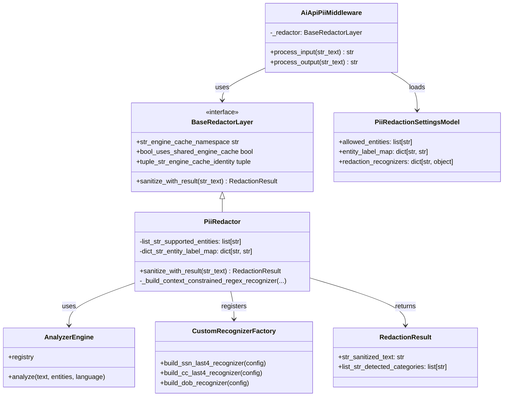

# AI API Middleware Extensibility Pattern for Unsupported Detection

## Summary

This document describes a general middleware extensibility pattern for cases where
a concrete middleware implementation does not support a required detection behavior out of the box.

The pattern is intended to support any AI API middleware where I/O data flow observation and filtering is necessary:

- In PII redaction middleware, this appears as custom entity recognizers.
- In observability middleware, this might appear as custom signal recognizers
  (for example, sensitive prompt markers, model-routing tags, trace cues).
- In prompt-injection middleware, this can appear as custom attack-pattern
  recognizers (for example, policy bypass phrases, role-hijack cues).
- In token counting and opex tracking middleware, this might appear as custom budget
  recognizers (for example, cost-threshold alerts and token-spike events).

The class-design implication is to keep a stable middleware interface and add
pluggable recognizer construction behind that interface, using a generic factory
name such as `CustomRecognizerFactory`.

This file keeps implementation detail focused only on the PII case study.

## Purpose

This document defines how the middleware extensibility pattern is initially applied to PII
redaction in `ai_api_unified`. It will inform future middleware extensibility design decisions.

For the PII case, this document specifies context-gated custom recognizers
for three edge cases not recognized by the default concrete implementation provider of Presidio:

- SSN last-4
- Credit card last-4
- DOB (date of birth)

The intent is high precision redaction with predictable behavior, minimal false
positives, and a reusable extension model for future middleware capabilities.

## Scope and Design Goal

This repository intentionally abstracts redaction behind middleware and base contracts. The application-facing API should never expose
concrete provider limitations or contracts directly.

Original Design Goals (none of these have changed from the original design)

- Keep Presidio-specific logic inside `middleware/impl/_presidio_redactor.py`.
- Keep policy and category semantics in canonical middleware settings.
- Keep top-level behavior provider-agnostic through `BaseRedactorLayer`.
- Preserve a stable middleware contract so future redaction implementations or detectors
  can be integrated with minimal changes to upstream code.

New Design Goal

- Use recognizer-factory composition in implementation classes so unsupported
  detection cases are additive extensions instead of interface changes.

## Presidio Support of Extending Entity Detection

Presidio supports custom detection through recognizers registered in `AnalyzerEngine.registry`.

Recognizer options:

- `PatternRecognizer`: regex + context terms.
- Custom recognizer class: full control over context windows and scoring.

Important detail:

- Presidio context terms increase confidence.
- Context terms alone are not a strict hard gate for all pattern cases.
- For strict rules like "only redact date near DOB-like text", implement explicit context-window checks in a custom recognizer.

Reference:

- https://microsoft.github.io/presidio/analyzer/adding_recognizers/

## Existing Repository Abstraction and Generic Path

Current generic path:

1. `AiApiPiiMiddleware` reads typed settings (`PiiRedactionSettingsModel`).
2. `_get_configured_redactor` lazy-loads Presidio-backed `PiiRedactor`.
3. `PiiRedactor.sanitize_with_result(...)` runs provider detection and anonymization.
4. Detected provider entities are mapped to canonical categories.
5. Output returns `RedactionResult` (sanitized text + detected categories + redaction count).

This means custom recognizers should integrate as implementation-side extensions while still mapping into canonical category policy.
The YAML contract remains provider-agnostic and only exposes middleware-level controls.

Presidio component lifecycle contract:

- `Presidio AnalyzerEngine` construction should be done once per deterministic configuration identity.
- Shared `Presidio AnalyzerEngine` instances should be treated as immutable after registration to avoid cross-request mutation risk.
- Cache identity should be surfaced by the base redactor contract so all implementations use the same reuse semantics.
- `Presidio AnalyzerEngine` cache keys should include the redactor cache identity signature, not only language/profile.

## Class Diagram Update

Focus on CustomRecognizerFactory



## Canonical Mapping Contract

Use provider entities for recognizers, then map to canonical categories for policy.

Recommended mapping:

- `US_SSN_LAST4` -> `SSN`
- `CREDIT_CARD_LAST4` -> `CC_LAST4` (new canonical category)
- `DOB_DATE` -> `DOB` (new canonical category)

If new canonical categories are introduced, update:

- `DICT_STR_CANONICAL_CATEGORY_TOKENS` in `middleware_config.py`
- `DICT_STR_PROVIDER_TO_CANONICAL_CATEGORY` in `_presidio_redactor.py`
- `DICT_STR_CANONICAL_TO_PROVIDER_CATEGORIES` in `_presidio_redactor.py`
- default `entity_label_map` behavior and docs/tests

## Edge Case Rules

### SSN last-4

Goal:

- Redact 4-digit tails only when SSN context exists.

Detection:

- Candidate pattern: `\\b\\d{4}\\b`
- Required nearby context terms:
  - `ssn`
  - `social security`
  - `last 4`
  - `ending in`

Positive examples:

- `SSN ending in 6789`
- `social security last 4: 1234`

Negative examples:

- `order 1234 shipped`
- `pin 1234`

### Credit card last-4

Goal:

- Redact card tails only with payment-card context.

Detection:

- Candidate pattern: `\\b\\d{4}\\b`
- Optional masked patterns: `**** 4242`, `xxxx-4242`
- Required nearby context terms:
  - `card`, `credit card`, `debit`
  - `visa`, `mastercard`, `amex`, `discover`
  - `ending in`, `last 4`

Positive examples:

- `Visa ending in 4242`
- `credit card last 4 is 1111`

Negative examples:

- `room 4242`
- `year 2024`

### DOB

Goal:

- Redact dates only when birth-date semantics are present.

Candidate date patterns:

- `YYYY-MM-DD`
- `MM/DD/YYYY`
- `DD-MM-YYYY`
- `Month DD, YYYY`

Required nearby context terms:

- `dob`
- `date of birth`
- `born`
- `birth date`

Optional negative context terms:

- `invoice date`
- `appointment date`
- `due date`

Positive examples:

- `DOB 1991-12-31`
- `Date of birth: 01/22/1988`
- `born 31-12-1991`

Negative examples:

- `Invoice date 1991-12-31`
- `Appointment date 01/22/2025`

## Default Redaction Semantics (Allow-List Behavior)

This repository uses allow-list semantics for canonical categories:

- `allowed_entities` means pass-through (whitelist).
- Categories not in `allowed_entities` are redacted.
- Empty or omitted `allowed_entities` means redact all supported canonical categories.

For custom edge recognizers, keep the same principle:

- Register custom recognizers by default.
- Include their canonical categories in default redaction scope.
- Let `allowed_entities` opt out of redaction per category.

This keeps behavior consistent with existing middleware policy.

## Config Updates (YAML)

Use `redaction_recognizers` (not `edge_recognizers`) to make naming explicit and policy-oriented.

Proposed YAML updates under `pii_redaction.settings`:

```yaml
middleware:
  - name: 'pii_redaction'
    enabled: true
    settings:
      direction: 'input_only'
      strict_mode: true
      detection_profile: 'balanced'
      language: 'en'
      country_scope: 'US'
      address_detection_enabled: true
      address_detection_provider: 'usaddress'
      span_conflict_policy: 'prefer_usaddress_longest'

      # Canonical allow-list: pass through only these categories.
      # Omit or [] to redact all supported categories.
      allowed_entities: []

      # Canonical output labels.
      entity_label_map:
        NAME: 'NAME'
        EMAIL: 'EMAIL'
        PHONE: 'PHONE'
        SSN: 'SSN'
        ADDRESS: 'ADDRESS'
        DOB: 'DOB'
        CC_LAST4: 'CC_LAST4'

      # Middleware-level extension config.
      # Provider-specific mapping stays internal to the concrete implementation.
      redaction_recognizers:
        proximity_window_chars: 28

        ssn_last4:
          enabled: true
          confidence_threshold: 0.75
          context_terms: ['ssn', 'social security']
          negative_context_terms: ['cc', 'credit card', 'debit', 'visa', 'mastercard', 'master card', 'amex', 'american express', 'discover']

        cc_last4:
          enabled: true
          confidence_threshold: 0.80
          context_terms: ['cc', 'card', 'credit card', 'debit', 'visa', 'mastercard', 'master card', 'amex', 'american express', 'discover', 'last 4', 'ending in']
          negative_context_terms: ['ssn', 'social security', 'expires', 'expiration', 'expiry', 'exp']

        dob:
          enabled: true
          confidence_threshold: 0.80
          context_terms: ['dob', 'date of birth', 'born', 'birth date']
          negative_context_terms: ['invoice date', 'appointment date', 'due date']
```

Migration guidance:

- Keep existing settings backward compatible by making `redaction_recognizers` optional.
- If `redaction_recognizers` is omitted, the implementation should fall back to default recognizer settings rather than failing validation.
- Default redaction behavior remains controlled by canonical `allowed_entities` allow-list semantics.

## Implementation Notes for Generic Integration

To keep Presidio hidden from top-level interfaces:

- Add a small internal parser for `settings.redaction_recognizers` in `PiiRedactionSettingsModel`.
- In `_presidio_redactor.py`, translate middleware-level recognizer settings into provider-specific registration data.
- Keep recognizer registration private to Presidio implementation.
- Continue returning only `RedactionResult` and canonical categories to callers.

Suggested internal API shape:

- `_build_context_constrained_recognizer(analyzer_engine, recognizer_settings)`
- `_build_context_constrained_regex_recognizer(...)`
- `_proximity_window_contains_terms(...)`

## Testing Strategy

Add tests for each recognizer in positive and negative contexts.

Required test groups:

- SSN last-4: context-positive and context-negative
- CC last-4: context-positive and context-negative
- DOB: birth-context positive, non-birth date negative
- Allow-list behavior with new canonical categories (`DOB`, `CC_LAST4`)
- Label-map behavior for new canonical categories
- Overlap behavior with existing entities (`SSN`, `CREDIT_CARD`, `DATE_TIME`, `LOCATION`)

## Operational Guidance

- Keep custom recognizer logs at debug level with no raw sensitive values.
- Tune context lists with production-like examples.
- Prefer stricter context gates for last-4 and DOB to minimize false positives.

## Related Standards - PII Guidance (SOC 2, PCI, CPRA)

This appendix is intended as design-doc input for three fields only:

- Date of birth (DOB)
- Last 4 digits of SSN
- Last 4 digits of credit card number (PAN)

## Plain-language bottom line

- DOB should be treated as personal information.
- SSN last 4 should be treated as sensitive personal data in enterprise controls, even if shown in some workflows.
- Credit card last 4 may be display-allowed under PCI, but it is still cardholder data context and still personal data under privacy laws _when linked to a person_.

## Standards-by-standard view

### SOC 2 (AICPA Trust Services Criteria)

SOC 2 is control-based, not a field-by-field masking law. It does not say "DOB must be masked this exact way." Instead, auditors expect:

- Data classification rules
- Need-to-know access controls
- Retention and disposal controls
- Monitoring that controls are operating as designed

What this means for these fields:

- DOB: classify as personal/confidential data and control access.
- SSN last 4: classify as high-sensitivity personal data.
- Card last 4: classify as sensitive payment-related data and restrict broad exposure.

### PCI DSS (payment card context)

PCI is specific about PAN display limits:

- PAN display is masked so BIN + last 4 is the maximum shown to most users.
- More than that requires a legitimate business need.

What this means for these fields:

- Card last 4: generally display-allowed in many PCI contexts, but only within PCI control boundaries.
- DOB and SSN last 4: not a PCI masking rule topic directly, but still must follow your broader enterprise privacy/security policy.

### CPRA (California privacy law framework)

CPRA defines personal information broadly as data that identifies or can reasonably be linked to a consumer or household.

- SSN is explicitly listed in identifiers and in sensitive personal information definitions.
- Financial account and card data with credentials are explicitly sensitive personal information.
- Even when a value is partial (for example last 4), if it can be linked to a consumer, treat it as personal information for controls and governance.

What this means for these fields:

- DOB: treat as personal information.
- SSN last 4: treat as personal information at minimum; enterprise best practice is to handle as sensitive due re-identification risk.
- Card last 4: may not always be "sensitive personal information" by itself under text-only interpretation, but should still be handled as personal information and tightly controlled.

## Recommended enterprise policy for design docs

For these three fields, use a strict and simple internal rule:

- Default: do not log full values.
- UI and tickets: minimize display; show only where business-justified.
- Prompts and LLM flows: redact or tokenize by default.
- Access: restrict by role and audited business need.
- Retention: shortest practical retention period.

Suggested handling profile:

- DOB: redact in logs and LLM prompts unless explicitly required.
- SSN last 4: redact in logs, analytics, and AI prompts by default.
- Card last 4: allow display only in approved payment-support workflows; redact elsewhere.

## Source references (official or standards bodies)

- AICPA Trust Services Criteria material (SOC 2 categories and criteria context):  
  https://us.aicpa.org/content/dam/aicpa/interestareas/frc/assuranceadvisoryservices/downloadabledocuments/trust-services-criteria-redlined.pdf
- AICPA SOC report overview (SOC 2 scope framing):  
  https://us.aicpa.org/content/dam/aicpa/interestareas/frc/assuranceadvisoryservices/downloadabledocuments/soc-reports-flyer-final.pdf
- PCI DSS SAQ C-VT (v4.0) requirement text for masked PAN display:  
  https://www.pcisecuritystandards.org/documents/PCI-DSS-v4-0-SAQ-C-VT.pdf
- PCI SSC FAQ on PAN truncation formats:  
  https://www.pcisecuritystandards.org/faq/articles/Frequently_Asked_Question/what-are-acceptable-formats-for-truncation-of-primary-account-numbers/
- California Civil Code, CCPA/CPRA title text (includes Sections 1798.100, 1798.121, 1798.140):  
  https://www.leginfo.legislature.ca.gov/faces/codes_displayText.xhtml?article=&chapter=&division=3.&lawCode=CIV&part=4.&title=1.81.5.
- California Civil Code, Customer Records title text (includes Section 1798.80 and 1798.81.5):  
  https://www.leginfo.legislature.ca.gov/faces/codes_displayText.xhtml?article=&chapter=&division=3.&lawCode=CIV&part=4.&title=1.81.

## Implementation Plan Addendum (Stacked PR Roadmap)

### Goal
Implement middleware extensibility for unsupported detection patterns in a phased, reviewable way, with PII as the first concrete implementation:

- SSN last-4
- Credit card last-4
- DOB (context-gated)

### Delivery Principles
- Keep middleware top-level contracts stable (`AiApiPiiMiddleware`, `BaseRedactorLayer`, `RedactionResult`).
- Keep Presidio details encapsulated inside `_presidio_redactor.py`.
- Add behavior incrementally with test coverage in each PR.
- Keep every PR releasable and backward-compatible.
- Use `redaction_recognizers` config namespace and `proximity_window_chars` naming.

### Cross-PR Invariants
- `allowed_entities` semantics remain unchanged (allow-list/pass-through).
- Existing redaction behavior for `NAME`/`PHONE`/`EMAIL`/`SSN`/`ADDRESS` remains intact unless explicitly changed in a phase.
- If `redaction_recognizers` is absent, system falls back to current behavior (no validation failure).
- No new mandatory settings in middleware YAML.
- Middleware YAML must stay implementation-agnostic. Provider entity names and provider scoring fields remain internal implementation details.

### PR Phase Plan

### Stacked Branch Plan

Use explicit branch names for stacked PR readability, while keeping the existing
Phase A branch unchanged.

| Phase | Branch name | PR base branch |
| --- | --- | --- |
| A | `69-middleware-extensibility-pattern` | `github/main` |
| B | `69-middleware-extensibility-pattern-stack02-config-contract` | `69-middleware-extensibility-pattern` |
| C | `69-mep-c-registration-plumbing` | `69-middleware-extensibility-pattern-stack02-config-contract` |
| D | `69-mep-d-ssn-last4` | `69-mep-c-registration-plumbing` |
| E | `69-mep-e-cc-last4` | `69-mep-d-ssn-last4` |
| F | `69-mep-f-dob` | `69-mep-e-cc-last4` |
| G | `69-mep-g-hardening-docs` | `69-mep-f-dob` |

#### PR A: Presidio Feasibility POC (Hard-Wired SSN Last-4)
Scope:
- Add a standalone POC module (`middleware_extensibility_poc.py`) under middleware impl.
- Implement hard-wired Presidio SSN last-4 detection with strict nearby SSN context checks.
- Keep this path isolated from production middleware wiring.

Files likely touched:
- `middleware/impl/middleware_extensibility_poc.py`
- optional POC-focused test module

Behavior:
- No production behavior change.
- Provides an executable proof that the core recognizer assumptions are valid before architecture work.

Tests:
- Positive corpus:
  - `SSN ending in 6789`
  - `social security last 4: 1234`
- Negative corpus:
  - unrelated 4-digit numbers (`pin 1234`, `order 1234`)
- Verify only context-qualified spans are redacted.

Exit criteria:
- POC can detect/redact SSN last-4 with acceptable precision in sample corpus.
- No impact to existing middleware runtime path.

#### PR B: Typed Config and No-Op Extension Contract
Scope:
- Add typed config model support for `settings.redaction_recognizers`.
- Add internal parsing/normalization defaults.
- Add internal extension interfaces (factory/config holders), but no recognizer behavior yet.
- Preserve the base redactor cache identity properties already established in Phase A baseline; no new behavior change required for cache lifecycle in this phase.
- Enforce middleware-level settings terminology (`confidence_threshold`, context terms) and remove provider-specific YAML fields.

Files likely touched:
- `middleware_config.py`
- `_presidio_redactor.py` (wiring only, if needed for config pass-through)
- middleware config tests

Behavior:
- No detection behavior change.

Tests:
- Config parsing tests:
  - missing `redaction_recognizers` -> valid defaults
  - partial recognizer config -> defaults filled
  - invalid recognizer config -> safe fallback/validation behavior
  - provider-specific keys are not part of typed middleware settings contract

Exit criteria:
- All existing tests pass.
- New config tests pass.
- No runtime redaction diffs.

#### PR C: Recognizer Registration Plumbing
Scope:
- Introduce `CustomRecognizerFactory` (or equivalent internal builder module).
- Register custom recognizers into the `Presidio AnalyzerEngine` registry via a dedicated private method.
- Keep recognizers disabled (or no-op) by default in this phase.

Files likely touched:
- New internal recognizer factory module under middleware impl
- `_presidio_redactor.py`
- `Presidio AnalyzerEngine` initialization tests

Behavior:
- Still no effective detection change.

Tests:
- Unit tests that custom recognizer registration is called and registry contains expected recognizer IDs when enabled.

Exit criteria:
- Registration path exists and is test-verified.
- No false-positive redaction changes yet.

#### PR D: SSN Last-4 Recognizer
Scope:
- Implement context-constrained recognizer for SSN last-4.
- Internal provider entity mapping: `US_SSN_LAST4` (not exposed in YAML).
- Canonical mapping to existing `SSN`.

Behavior:
- Redact 4-digit tails only with SSN context.

Tests:
- Positive corpus:
  - `SSN ending in 6789`
  - `social security last 4: 1234`
- Negative corpus:
  - unrelated 4-digit numbers (`pin 1234`, `order 1234`)
- Verify canonical category output includes `SSN`.

Exit criteria:
- Precision-focused tests pass.
- No regression on existing SSN full-pattern detection.

#### PR E: Credit Card Last-4 Recognizer
Scope:
- Implement context-constrained recognizer for card last-4.
- Internal provider entity mapping: `CREDIT_CARD_LAST4` (not exposed in YAML).
- Add canonical category `CC_LAST4` mapping and label handling.

Behavior:
- Redact 4-digit tails only in payment-card context.

Tests:
- Positive corpus:
  - `Visa ending in 4242`
  - `credit card last 4 is 1111`
- Negative corpus:
  - `room 4242`, `year 2024`
- Verify canonical output and token labeling for `CC_LAST4`.
- Verify allow-list pass-through (`allowed_entities: [CC_LAST4]`) works.

Exit criteria:
- New canonical category works end-to-end (mapping, labels, allow-list).

#### PR F: DOB Context-Gated Recognizer
Scope:
- Implement DOB recognizer with strict context gating and optional negative context terms.
- Internal provider entity mapping: `DOB_DATE` (not exposed in YAML).
- Add canonical category `DOB` mapping and label handling.
- Keep the middleware contract explicit: runtime DOB qualification rules must come from visible config semantics (`context_terms`, `negative_context_terms`, candidate date formats), not from hidden recognizer-only heuristics.
- Reuse the Phase D / E overlap lessons: stricter DOB detections must not be overridden by broader parser-backed or generic provider spans on the same text.

Behavior:
- Redact date values only when birth-date semantics are present.
- Candidate date formats should stay intentionally narrow and reviewable for this phase:
  - `YYYY-MM-DD`
  - `MM/DD/YYYY`
  - `DD-MM-YYYY`
  - `Month DD, YYYY`
- Generic dates without DOB-oriented nearby context must remain unredacted.
- Explicit negative date context must suppress DOB classification even when a valid date pattern exists.
- Canonical allow-list behavior must still win: if `DOB` is allow-listed, the date must pass through while still preventing broader overlapping detections from misclassifying the same span.

Tests:
- Positive corpus:
  - `DOB 1991-12-31`
  - `Date of birth: 01/22/1988`
  - `born 1991-12-31`
- Negative corpus:
  - `Invoice date 1991-12-31`
  - `Appointment date 01/22/2025`
  - `Due date 2025-01-31`
  - `The event is on 1991-12-31`
- Short-context corpus:
  - single-anchor positive phrasing such as `born 1991-12-31` should work when config intentionally narrows `context_terms`
  - single-anchor negative phrasing should still suppress redaction when `negative_context_terms` are configured
- Overlap/conflict corpus:
  - DOB date text must not be relabeled by broader overlapping detections if the strict DOB recognizer wins the span
  - `allowed_entities: [DOB]` must pass the raw DOB value through without allowing another category to redact the same span
- Verify canonical output and token labeling for `DOB`.
- Verify allow-list pass-through for `DOB`.

Exit criteria:
- DOB redaction is context-sensitive and low-noise.
- No hidden runtime-only qualification rule exists beyond the documented middleware config contract.
- Mixed date text no longer regresses into generic date/address-style false positives once DOB logic is enabled.

#### PR G: Policy Hardening, Docs, and Rollout Defaults
Scope:
- Finalize defaults for `redaction_recognizers` blocks and thresholds.
- Update README + design docs + config examples.
- Add integration/nonmock tests for overlap/conflict and multi-entity inputs.
- Precompile context-term ordering and boundary-match patterns inside recognizers to avoid per-candidate sorting and regex construction overhead.
- Move timing and audit logging from `AiApiPiiMiddleware` into a shared middleware-layer wrapper so all middleware categories can reuse the same observability contract.
- Add info-level timing logs for middleware execution cost per middleware category so long-input overhead can be measured in production-like runs.
- Add info-level audit logs whenever one or more redactions occur, without logging raw PII values.
- Label audit events as `security_control_applied` so downstream alerting can treat a redaction as a successful security-control hit.
- Add mixed-record regression coverage for prompts where CC last-4 and SSN last-4 appear near each other.
- Update docs to show minimal YAML first and expanded override-only YAML second.

Implementation steps:
- Add a shared concrete middleware base such as `InstrumentedAiApiMiddleware` under the middleware package.
- Keep `AiApiMiddleware` as the minimal public interface only.
- Move generic timing measurement and audit/timing log emission into the shared concrete base.
- Define a generic metadata contract returned by concrete middleware execution methods, rather than coupling the shared wrapper to `RedactionResult`.
- Update `AiApiPiiMiddleware` to:
  - Execute redaction through the shared wrapper.
  - Translate `RedactionResult` into generic middleware observability metadata.
  - Keep PII-specific metadata limited to redaction count and canonical categories.
- Keep logger names and event labels stable unless a reviewable reason exists to change them.
- Add unit tests proving the shared middleware wrapper logs timing and security-control metadata correctly.
- Keep the existing PII middleware observability tests, but update them so they validate the shared wrapper path rather than a PII-only implementation detail.

Tests:
- Mixed-content scenarios containing names, address, SSN last-4, CC last-4, DOB.
- Span conflict behavior with existing entities.
- Backward-compat test when `redaction_recognizers` omitted.
- Logging tests should allow expected info-level middleware timing messages if timing instrumentation is added in this phase.
- Logging tests should assert info-level audit events when redaction count is non-zero.
- Manual-only middleware performance benchmark should continue to run outside default pytest flows and log average and median metrics for simple and mixed inputs.

Exit criteria:
- Docs reflect final config contract.
- Shared middleware observability wrapper is in place and `AiApiPiiMiddleware` uses it.
- Full test matrix green.
- Feature considered production-ready.

### Suggested Review Strategy
- Keep each PR under one primary concern (POC, config, plumbing, SSN, CC, DOB, hardening).
- Require side-by-side before/after examples in PR descriptions.
- For recognizer PRs, include a false-positive table in the PR description:
  - sample text
  - expected detect or ignore
  - actual result

### Risk Notes
- Highest risk: false positives on generic 4-digit patterns and generic dates.
- Mitigation: strict context gating + negative context + conservative defaults + corpus tests.
- Keep thresholds and context terms configurable to avoid code churn for tuning.
