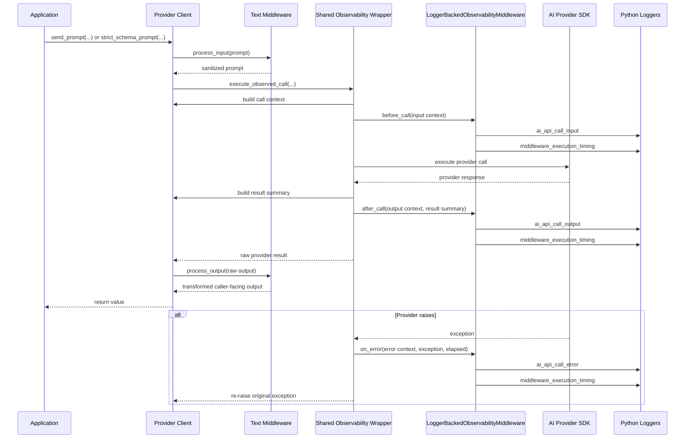

# Observability Middleware Design

## Summary

This document describes the shipped observability middleware design in
`ai_api_unified`.

The implementation adds a lifecycle-style middleware component that emits
metadata-only logs around AI provider calls for:

- completions
- embeddings
- image generation
- text-to-speech

Observability is configuration-driven, logger-backed, fail-open, and internal to
the provider call path. Applications continue calling the same public methods
they used before observability existed.

Companion documents:

- `docs/observability_middleware_implementation_plan.md`
- `docs/observability_middleware_test_plan.md`

## Design Goals

- keep the existing text-transform middleware contract intact
- add observability without introducing a new client-facing call pattern
- emit one input, output, or error event sequence per public AI call
- log metadata only by default
- keep hot-path work bounded and synchronous
- preserve provider behavior when observability fails
- reuse the existing middleware timing log pattern

## What Ships Today

The shipped runtime includes:

- typed YAML config for `observability`
- a disabled no-op middleware when observability is not enabled
- a logger-backed lifecycle middleware when observability is enabled
- request-scoped caller, session, and workflow context via `contextvars`
- shared wrappers for provider-boundary input, output, and error emission
- integration across completions, embeddings, images, and TTS
- targeted cleanup of raw AI content logging in touched provider paths

The shipped runtime does not include:

- speech-to-text observability
- asynchronous export, batching, or queueing inside middleware
- token estimation logic
- OpenTelemetry export
- full centralization of all library logging behind observability

## Core Architecture

### Middleware Roles

The library now has two distinct middleware roles:

- text-transform middleware
  - used for payload mutation such as PII processing
- lifecycle observability middleware
  - used for metadata-only logging around provider calls

`AiApiMiddleware` remains text-oriented and is not widened to carry images,
audio, or embeddings.

`AiApiObservabilityMiddleware` is the lifecycle contract:

- `before_call(call_context)`
- `after_call(call_context, call_result_summary)`
- `on_error(call_context, exception, float_elapsed_ms)`

### Client-Facing Behavior

Applications do not call observability directly.

The execution model is:

- application code calls the normal public AI method
- provider code invokes any text-transform middleware already in that path
- provider code invokes shared observability wrappers around the provider call
- observability emits logger-backed metadata if enabled

This keeps middleware in the path while preserving the existing public API.

## Class Diagram

```mermaid
classDiagram
    class AiApiMiddleware {
        <<abstract>>
        +process_input(str_text) str
        +process_output(str_text) str
    }

    class AiApiPiiMiddleware {
        +process_input(str_text) str
        +process_output(str_text) str
    }

    class AiApiObservabilityMiddleware {
        <<abstract>>
        +bool_enabled bool
        +before_call(call_context) None
        +after_call(call_context, call_result_summary) None
        +on_error(call_context, exception, float_elapsed_ms) None
    }

    class NoOpObservabilityMiddleware {
        +bool_enabled bool
    }

    class LoggerBackedObservabilityMiddleware {
        +observability_settings ObservabilitySettingsModel
        +event_logger Logger
        +metrics_logger Logger
    }

    class MiddlewareConfig {
        +get_observability_settings() ObservabilitySettingsModel | None
    }

    class ObservabilitySettingsModel {
        +direction str
        +capabilities list[str]
        +log_level str
        +token_count_mode str
        +include_media_details bool
        +include_provider_usage bool
        +include_audio_byte_count bool
        +include_image_byte_count bool
        +emit_error_events bool
    }

    class AiApiCallContextModel {
        +call_id str
        +event_time_utc datetime
        +capability str
        +operation str
        +provider_vendor str
        +provider_engine str
        +model_name str | None
        +model_version str | None
        +direction str
        +originating_caller_id str | None
        +originating_caller_id_source str
        +dict_metadata Mapping[str, ObservabilityMetadataValue]
        +with_direction(direction) AiApiCallContextModel
    }

    class AiApiCallResultSummaryModel {
        +provider_elapsed_ms float
        +input_token_count int | None
        +input_token_count_source str
        +output_token_count int | None
        +output_token_count_source str
        +provider_prompt_tokens int | None
        +provider_completion_tokens int | None
        +provider_total_tokens int | None
        +finish_reason str | None
        +dict_metadata Mapping[str, ObservabilityMetadataValue]
    }

    class ObservabilityContextModel {
        +caller_id str | None
        +session_id str | None
        +workflow_id str | None
    }

    class AIBase {
        +_build_observability_call_context(...)
        +_execute_provider_call_with_observability(...)
    }

    class AIVoiceBase {
        +_build_observability_call_context(...)
        +_execute_voice_call_with_observability(...)
    }

    AiApiPiiMiddleware --|> AiApiMiddleware
    NoOpObservabilityMiddleware --|> AiApiObservabilityMiddleware
    LoggerBackedObservabilityMiddleware --|> AiApiObservabilityMiddleware
    LoggerBackedObservabilityMiddleware --> ObservabilitySettingsModel
    LoggerBackedObservabilityMiddleware --> AiApiCallContextModel
    LoggerBackedObservabilityMiddleware --> AiApiCallResultSummaryModel
    MiddlewareConfig --> ObservabilitySettingsModel
    AIBase --> AiApiObservabilityMiddleware
    AIBase --> AiApiCallContextModel
    AIBase --> AiApiCallResultSummaryModel
    AIVoiceBase --> AiApiObservabilityMiddleware
    AIVoiceBase --> AiApiCallContextModel
    AIVoiceBase --> AiApiCallResultSummaryModel
```



## Sequence Diagram

The sequence below reflects the shipped completions path. Other capabilities use
the same wrapper pattern with capability-specific metadata builders.



## Runtime Objects

### `AiApiCallContextModel`

This immutable object carries shared per-call metadata used across input,
output, and error events.

Shipped fields:

- `call_id`
- `event_time_utc`
- `capability`
- `operation`
- `provider_vendor`
- `provider_engine`
- `model_name`
- `model_version`
- `direction`
- `originating_caller_id`
- `originating_caller_id_source`
- `dict_metadata`

Implementation notes:

- `call_id` is generated once per public call
- `event_time_utc` is regenerated per emitted event direction
- `model_version` currently defaults to the resolved model identifier when no
  richer provider version string is available
- `dict_metadata` is frozen into an immutable mapping

### `AiApiCallResultSummaryModel`

This immutable object carries only scalar output metadata.

Shipped fields:

- `provider_elapsed_ms`
- `input_token_count`
- `input_token_count_source`
- `output_token_count`
- `output_token_count_source`
- `provider_prompt_tokens`
- `provider_completion_tokens`
- `provider_total_tokens`
- `finish_reason`
- `dict_metadata`

This object never stores full provider payloads.

### Request-Scoped Context API

Applications can attach correlation identifiers without widening every public
method signature:

- `set_observability_context(caller_id=..., session_id=..., workflow_id=...)`
- `get_observability_context()`
- `reset_observability_context(token)`

Shipped behavior:

- identifiers are optional
- values are trimmed
- blank strings are discarded
- caller context takes precedence over legacy caller hints

## Caller Correlation

`originating_caller_id` is optional.

Shipped resolution order:

1. explicit request-scoped `caller_id` from `set_observability_context(...)`
2. explicit legacy caller hint supplied by the client implementation, such as
   `self.user` in supported OpenAI clients
3. omitted, with `originating_caller_id_source="none"`

Shipped source labels:

- `application_context`
- `legacy_setting`
- `none`

Security position:

- no caller id is derived from secrets
- no caller id is derived from provider principals
- caller correlation is opt-in and application-defined

Provider propagation is intentionally narrower than local logging:

- OpenAI embeddings send explicit request-scoped caller ids through `user`
- OpenAI images send explicit request-scoped caller ids through `user`
- OpenAI completions do not currently propagate caller ids to the provider
- TTS providers currently log caller ids locally only
- Gemini and Bedrock integrations currently log caller ids locally only

## Logging Model

### Loggers

Shipped logger names:

- `ai_api_unified.middleware.observability`
- `ai_api_unified.middleware.metrics`

### Event Names

Shipped event labels:

- `ai_api_call_input`
- `ai_api_call_output`
- `ai_api_call_error`

Shared middleware timing is emitted with the existing metrics pattern:

- `middleware_execution_timing`

### Always-Present Shared Event Fields

Every emitted event includes:

- `call_id`
- `direction`
- `capability`
- `operation`
- `provider_vendor`
- `provider_engine`
- `model_name`
- `model_version`
- `event_time_utc`

When present, events may also include:

- `originating_caller_id`
- `originating_caller_id_source`
- `session_id`
- `workflow_id`

Output and error events also include:

- `provider_elapsed_ms`

Error events also include:

- `exception_type`

### Metadata Collision Handling

`dict_metadata` entries are merged into the event payload.

If metadata collides with a reserved field name, the emitted key is prefixed
with:

- `meta_`

This preserves stable event keys while still retaining the conflicting metadata.

## Capability-Specific Metadata

The shipped runtime emits the following capability-specific fields when they are
available.

### Completions

Input-side metadata:

- `prompt_char_count`
- `prompt_token_count_source`
- `system_prompt_char_count`
- `system_prompt_token_count_source`
- `has_media_attachments`
- `response_mode`
- `max_response_tokens`
- `media_attachment_count`
- `media_total_bytes`
- `media_mime_types`

Output-side metadata:

- `output_char_count`
- `continued_response` when OpenAI text completions had to continue after a
  length stop
- `finish_reason`
- `input_token_count`
- `input_token_count_source`
- `output_token_count`
- `output_token_count_source`
- `provider_prompt_tokens`
- `provider_completion_tokens`
- `provider_total_tokens`

Notes:

- token counts currently come from provider usage or `none`
- no local token estimator is currently implemented
- structured-response observability summarizes metadata only and never logs raw
  JSON content

### Embeddings

Input-side metadata:

- `input_text_count`
- `input_text_total_chars`
- `input_text_max_chars`
- `batch_mode`
- `requested_dimensions`

Output-side metadata:

- `embedding_count`
- `returned_dimensions`
- `input_token_count`
- `input_token_count_source`
- `provider_prompt_tokens`
- `provider_total_tokens`

Vectors are never logged.

### Images

Input-side metadata:

- `prompt_char_count`
- `requested_width`
- `requested_height`
- `requested_num_images`
- `requested_format`
- `requested_quality`
- `requested_background`

Output-side metadata:

- `generated_image_count`
- `total_output_bytes`
- `output_format`
- `input_token_count`
- `input_token_count_source`
- `provider_prompt_tokens`
- `provider_total_tokens`

Image bytes are not logged. The byte total is computed from already-returned
payloads.

### Text-to-Speech

Input-side metadata:

- `input_text_char_count`
- `streaming_mode`
- `speaking_rate`
- `use_ssml`
- `voice_id`
- `voice_name`
- `voice_locale`
- `requested_audio_format`
- `requested_audio_extension`
- `emotion_prompt_char_count`

Output-side metadata:

- `output_audio_byte_count`
- `output_audio_format`

TTS does not currently emit token usage.

## Configuration

Observability uses the existing YAML middleware profile mechanism.

Example:

```yaml
middleware:
  - name: "observability"
    enabled: true
    settings:
      direction: "input_output"
      capabilities:
        - "completions"
        - "embeddings"
        - "images"
        - "tts"
      log_level: "INFO"
      token_count_mode: "provider_or_estimate"
      include_media_details: true
      include_provider_usage: true
      include_audio_byte_count: true
      include_image_byte_count: true
      emit_error_events: true
```

Shipped settings:

- `direction`
- `capabilities`
- `log_level`
- `token_count_mode`
- `include_media_details`
- `include_provider_usage`
- `include_audio_byte_count`
- `include_image_byte_count`
- `emit_error_events`

Shipped runtime behavior for these settings:

- `direction` gates input and output event emission
- `capabilities` acts as an allow-list
- `emit_error_events` gates error events
- `include_media_details` suppresses media summary fields
- `include_provider_usage` suppresses provider usage fields
- `include_audio_byte_count` suppresses TTS byte-count fields
- `include_image_byte_count` suppresses image byte-count fields
- `token_count_mode="none"` suppresses all token-count and provider-usage token fields

Important current limitation:

- `token_count_mode="provider_or_estimate"` is accepted by config, but the
  shipped runtime currently emits only provider counts or `none`
- no estimated token counter is implemented yet

Observability remains fail-open even when enabled. Logging failures do not block
provider execution.

## Supported Provider Coverage

The shipped implementation covers these provider paths:

- completions
  - OpenAI
  - Google Gemini
  - Bedrock
- embeddings
  - OpenAI
  - Google Gemini
  - Bedrock Titan
- images
  - OpenAI
  - Bedrock Nova Canvas
- text-to-speech
  - OpenAI
  - Google
  - Azure
  - ElevenLabs

This design doc intentionally describes shipped coverage only. It does not claim
Vertex AI observability support because that provider path is not implemented in
this repository.

## Ordering Rules

Observability is meant to describe the provider boundary.

For completions with text-transform middleware:

- input transform runs first
- observability input emits immediately before the provider call
- observability output emits immediately after provider return
- output transform runs after observability output

This means:

- input events describe the sanitized prompt sent to the provider
- output events describe provider-returned metadata before any output-side text
  transformation

For embeddings, images, and TTS, observability wraps the provider call directly
because there is no equivalent text-transform middleware in those paths.

## Error Handling

Observability must never change provider exception behavior.

Shipped behavior:

- hook failures are swallowed with a local warning
- provider exceptions are re-raised unchanged
- error events include only metadata, not raw payload content
- call-context or result-summary construction failures also fail open

## Performance Characteristics

The shipped design keeps hot-path work bounded by:

- resolving disabled middleware to a no-op object
- skipping wrapper context construction when observability is disabled
- using `time.perf_counter()` for elapsed provider timing
- avoiding image or audio decoding for derived duration or dimension estimates
- logging only scalar metadata and tuple-valued MIME summaries
- leaving export, shipping, and retention to normal logging infrastructure

## Mermaid Summary

The two Mermaid diagrams in this document should be treated as the authoritative
high-level view of how observability fits into the current library:

- the class diagram shows the split between text-transform and lifecycle middleware
- the sequence diagram shows that observability is internal to the provider path

## References

- [OpenTelemetry semantic conventions for generative AI systems](https://opentelemetry.io/docs/specs/semconv/gen-ai/)
- [OpenTelemetry semantic conventions for generative AI metrics](https://opentelemetry.io/docs/specs/semconv/gen-ai/gen-ai-metrics/)
- [Google Cloud AI and ML perspective: operational excellence](https://docs.cloud.google.com/architecture/framework/perspectives/ai-ml/operational-excellence)
- [AWS Prescriptive Guidance: observability and monitoring for generative AI workflows](https://docs.aws.amazon.com/prescriptive-guidance/latest/agentic-ai-serverless/observability-and-monitoring.html)
- [Microsoft Foundry observability guidance](https://learn.microsoft.com/en-us/azure/foundry/concepts/observability)
- [Google Cloud API key best practices](https://docs.cloud.google.com/docs/authentication/api-keys-best-practices)
- [OWASP guidance on sensitive data in logs](https://mas.owasp.org/MASWE/MASVS-STORAGE/MASWE-0001/)
