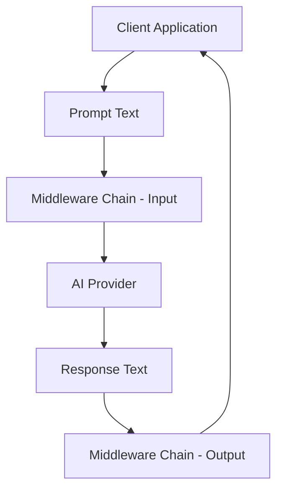
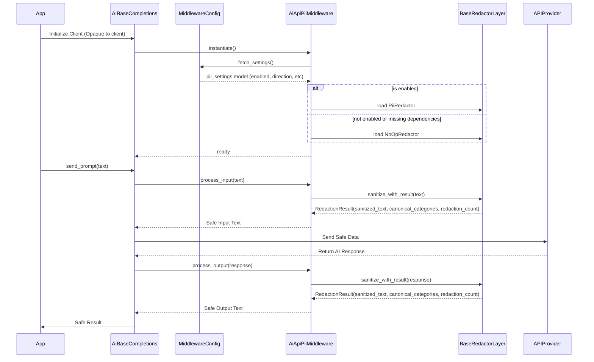
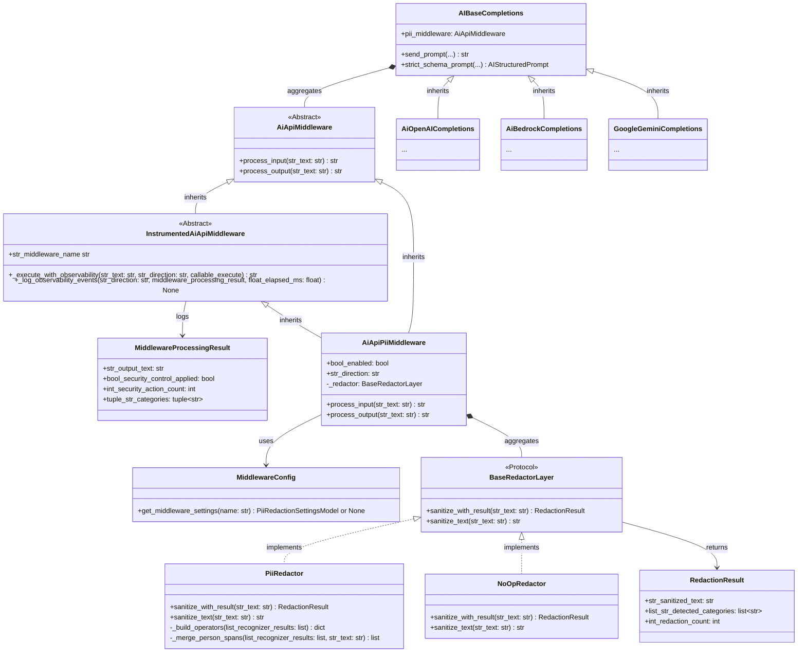
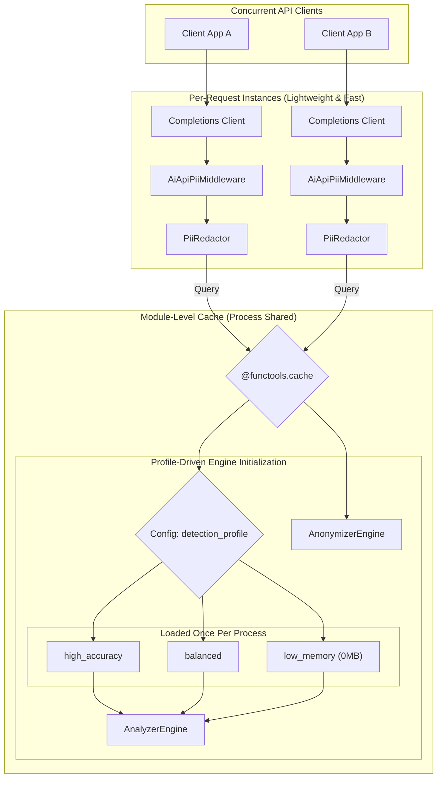
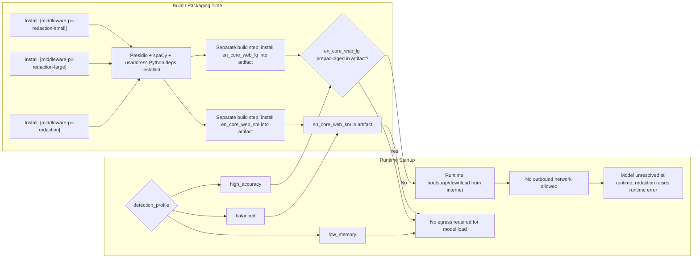

# PII Redaction Specification for ai-api-unified

## TL;DR:

This specification defines the PII (Personally Identifiable Information) redaction layer for the `ai_api_unified` library. The goal is to provide a robust, opt-in mechanism to prevent PII (e.g., phone numbers, emails, first/last names) from being leaked. The behavior will be configured exclusively via a YAML middleware configuration profile.

This is designed as a **seamless middleware pattern**. The calling of this PII middleware is explicitly **opaque to the client application**. The client does not pass any flags, decorators, or objects into the API calls to enforce redaction—redaction happens automatically at the library boundary based entirely on the environment configuration.



## Background & Context

The library needs a consistent, policy-driven way to prevent personally identifiable information (PII) from being sent to or returned from LLM providers in raw form. This design introduces an opt-in redaction middleware at the library boundary so redaction behavior is centralized, configuration-based, and opaque to calling applications.

## Current State

Without middleware-driven redaction enabled, prompts and completion outputs can pass through provider integrations unmodified. PII controls are not consistently enforced at a single boundary unless teams configure and enable the PII middleware profile, including optional Presidio-based dependencies and strict-mode behavior.

## System Design

PII redaction is implemented as configurable middleware in the YAML middleware profile (`pii_redaction`) with deterministic direction control (`input_only`, `output_only`, `input_output`) and strict-mode dependency policy (`strict_mode`). `AiApiPiiMiddleware` loads settings through `MiddlewareConfig`, dynamically imports the Presidio implementation, routes text through `process_input` and `process_output`, and raises explicit dependency/runtime exceptions when redaction cannot execute safely.

## Scope

- Applies ONLY to text content sent for **Completions** (prompts) and text received from them (completions).
- It explicitly **does NOT** apply to Embeddings or Voice (TTS/STT) generation.
- Default is disabled unless explicitly enabled in the Middleware Configuration Profile.
- Ensures PII is never logged in its raw form; only obfuscated samples are permitted in logs.

## Design

### Configuration Rule

- Configuration for PII redaction must be defined in the Middleware Configuration Profile (YAML).
- Callers to the completions APIs should have no direct control over redaction middleware configuration. This configuration is intended to be set by policy at the library boundary, completely opaque to the client logic.

### Generic Middleware Pattern (`AiApiMiddleware`)

- To formalize the middleware pattern, the library defines an abstract base class `AiApiMiddleware`.
- This interface allows for generic processing of text bound to and received from AI providers.
- While the immediate use case is PII redaction (`AiApiPiiMiddleware`), this pattern lays the foundation for future extensions such as observability logging, prompt injection filtering, and data transformations.

### Middleware Configuration Profile

To manage the growing stack of middleware components deterministically, the library uses a YAML-based configuration profile. This profile acts as the source of truth for both _which_ middleware is enabled and _how_ each component is configured, replacing raw boolean environment variables for complex behavior.

- **File resolution:** The library reads `AI_MIDDLEWARE_CONFIG_PATH` and loads middleware YAML only when the path exists. The middleware YAML file is the source of truth for middleware enablement and settings across middleware types. If the path is unset or missing, middleware remains disabled. YAML parse/read/decode failures fall back to an empty middleware config.

#### YAML Configuration Structure

The YAML file defines a list of middleware components. They are executed in the order they are defined for inputs, and in reverse order for outputs.

```yaml
middleware:
  - name: 'pii_redaction'
    enabled: true
    settings:
      direction: 'input_only'

  - name: 'observability'
    enabled: false
    settings:
      log_level: 'DEBUG'
```

Minimal config should stay minimal. Omit `allowed_entities`, `entity_label_map`,
and `redaction_recognizers` when the library defaults are acceptable. Expanded
YAML examples are override examples, not required baseline configuration.

**Settings Activation Rule (`settings`):**
For each middleware component, `enabled: true` is not sufficient by itself. The component is active only when `settings` is a non-empty dictionary. Missing settings, non-dictionary settings, or `{}` are treated as disabled.

**Middleware Entry Defaults (`middleware[].*`):**

| Field      | Required | Default if omitted | Runtime behavior                                                             |
| ---------- | -------- | ------------------ | ---------------------------------------------------------------------------- |
| `name`     | Yes      | None               | Must equal `pii_redaction` for this component to apply.                      |
| `enabled`  | No       | `false`            | Missing/false disables the component.                                        |
| `settings` | No       | None               | Missing, non-dict, or `{}` disables the component even when `enabled: true`. |

**Configuration Container Defaults (`middleware` root):**

| Field        | Required | Default if omitted/invalid | Runtime behavior                                               |
| ------------ | -------- | -------------------------- | -------------------------------------------------------------- |
| `middleware` | No       | `[]`                       | Missing or non-list means no middleware components are active. |

**Configuration Model (Pydantic vs middleware settings):**

- `EnvSettings` uses Pydantic (`BaseSettings`) for environment variables.
- `pii_redaction.settings` is validated into a typed Pydantic settings model.
- Type coercion and defaults are applied by that model before middleware initialization.

**Canonical category contract (`allowed_entities` and output labels):**

The middleware uses a provider-agnostic category contract at the boundary. Configuration and middleware outputs use canonical categories, while provider-specific labels remain internal to each implementation.

| Canonical category | Purpose                                     | Presidio provider labels mapped internally |
| ------------------ | ------------------------------------------- | ------------------------------------------ |
| `NAME`             | Person names                                | `PERSON`                                   |
| `PHONE`            | Phone numbers                               | `PHONE_NUMBER`                             |
| `EMAIL`            | Email addresses                             | `EMAIL_ADDRESS`                            |
| `SSN`              | US social security numbers                  | `US_SSN`                                   |
| `CC_LAST4`         | Payment-card last-4 values                  | `CREDIT_CARD_LAST4`                        |
| `ADDRESS`          | US postal addresses and location-like spans | `LOCATION`, `FAC`, `GPE`, `LOC`            |

### Middleware Provider Contract

Every concrete redaction provider implementation adheres to this contract:

- Accept the validated middleware settings model and execute redaction using that configuration.
- Detect provider-native categories and map them to canonical middleware categories before policy evaluation.
- Enforce `allowed_entities` against canonical categories so allow-list behavior is provider-agnostic.
- Apply `entity_label_map` using canonical categories when constructing redaction tokens.
- Return the base redaction result contract with sanitized text, canonical category metadata, and redaction-count metadata.
- Keep provider-native classes, labels, and dependency details inside the implementation boundary.
- Raise provider runtime errors through middleware error handling so strict-mode fail-closed semantics are preserved.

**Observability Contract**

- Middleware emits info-level audit events on logger `ai_api_unified.middleware.audit` whenever one or more spans are redacted.
- Middleware emits info-level execution timing on logger `ai_api_unified.middleware.metrics` for every executed redaction pass.
- Audit and timing logs are metadata-only and must not contain raw source text or raw redacted values.
- Audit events use the `security_control_applied` label so downstream log routing can treat redaction hits as successful security-control actions rather than warnings.
- Timing events include total elapsed milliseconds and milliseconds per redaction when one or more spans are redacted.
- Middleware observability is implemented as a shared middleware-layer abstraction so every middleware category can emit the same timing and security-control metadata consistently.

**Shared Middleware Observability Design**

- `AiApiMiddleware` is the minimal public interface with `process_input(...)` and `process_output(...)`.
- `InstrumentedAiApiMiddleware` is the shared concrete base under the middleware package.
- `InstrumentedAiApiMiddleware` owns the generic timing and audit wrapper around one middleware execution step.
- Concrete middleware implementations should provide only middleware-specific processing and metadata collection.

Recommended shared wrapper contract:

- Shared wrapper responsibilities:
  - Measure wall-clock elapsed milliseconds for one middleware execution.
  - Emit info-level timing logs on `ai_api_unified.middleware.metrics`.
  - Emit info-level security-control audit logs on `ai_api_unified.middleware.audit` when the middleware reports that one or more security-relevant actions occurred.
  - Keep logs metadata-only and stable across middleware categories.
- Concrete middleware responsibilities:
  - Execute domain-specific processing.
  - Return sanitized output and middleware-specific metadata.
  - Describe whether a security-control event occurred.
  - Supply category-specific metadata fields such as redaction count and canonical categories.

Recommended class split:

- `AiApiMiddleware`
  - Abstract interface only.
- `InstrumentedAiApiMiddleware`
  - Shared execution wrapper and logging implementation.
  - Shared logger names and log message shapes.
- `AiApiPiiMiddleware`
  - PII-specific settings loading.
  - PII-specific execution through `BaseRedactorLayer`.
  - PII-specific observability metadata assembly.

Recommended PII metadata payload supplied to the shared wrapper:

- `middleware_name="pii_redaction"`
- `direction="input"` or `direction="output"`
- `bool_security_control_applied`
- `int_redaction_count`
- `tuple_str_detected_categories`
- `float_ms_per_redaction | None`

Implementation notes:

- The shared wrapper should not depend on `RedactionResult` directly.
- The shared wrapper should accept generic middleware metadata so other middleware categories can reuse it without inheriting PII-specific result shapes.
- `AiApiPiiMiddleware` should translate `RedactionResult` into the generic wrapper metadata contract.

**`pii_redaction.settings` runtime field contract:**

| Field                        | Required in non-empty `settings` | Runtime default if omitted                                             | Runtime notes                                                                                                                                     |
| ---------------------------- | -------------------------------- | ---------------------------------------------------------------------- | ------------------------------------------------------------------------------------------------------------------------------------------------- |
| `direction`                  | No                               | `input_only`                                                           | Effective values: `input_only`, `output_only`, `input_output`. Any other value falls back to `input_only`. |
| `strict_mode`                | No                               | `false`                                                                | Parsed with truthy-string coercion (`true`, `1`, `yes`, `on`, `t`).                                                                               |
| `detection_profile`                | No                               | `balanced`                                                         | `high_accuracy`, `balanced`, `low_memory`; invalid values fall back to `balanced`.                                              |
| `language`                   | No                               | `en`                                                                   | Analyzer language code.                                                                                                                           |
| `country_scope`              | No                               | `US`                                                                   | Uppercased at runtime.                                                                                                                            |
| `address_detection_enabled`  | No                               | `true`                                                                 | Parsed with boolean coercion.                                                                                                                     |
| `address_detection_provider` | No                               | `usaddress`                                                            | Lowercased at runtime.                                                                                                                            |
| `span_conflict_policy`       | No                               | `prefer_usaddress_longest`                                             | Lowercased at runtime.                                                                                                                            |
| `default_redaction_label`    | No                               | `REDACTED`                                                             | Used for unknown entity labels.                                                                                                                   |
| `allowed_entities`           | No                               | `[]`                                                                   | Empty means redact all canonical categories. Non-empty values pass through those canonical categories without redaction.                          |
| `entity_label_map`           | No                               | `{NAME: NAME, PHONE: PHONE, EMAIL: EMAIL, SSN: SSN, ADDRESS: ADDRESS, DOB: DOB, CC_LAST4: CC_LAST4}` | Defines output token labels for canonical categories and does not control redaction scope.                                                                                             |
| `redaction_recognizers`      | No                               | Typed defaults for `ssn_last4`, `cc_last4`, `dob`, and `proximity_window_chars` | `ssn_last4`, `cc_last4`, and `dob` settings control runtime contextual detection. Omitted fields inherit defaults. Explicit empty lists override defaults and remain empty. DOB candidate formats are intentionally narrow in this phase: `YYYY-MM-DD`, `MM/DD/YYYY`, `DD-MM-YYYY`, and `Month DD, YYYY`. |

**Last-4 Context Ambiguity Note:**
Generic phrases such as `last 4` and `ending in` can appear in both SSN and card workflows. The SSN last-4 defaults therefore require SSN-specific anchors and reject card-oriented nearby terms so card-tail phrasing is not classified under canonical `SSN`.

**Allow-List Configuration (`allowed_entities`):**
By default, the middleware redacts all supported canonical categories (`NAME`, `PHONE`, `EMAIL`, `SSN`, `ADDRESS`, `DOB`, `CC_LAST4`). The `allowed_entities` setting is an explicit canonical allow-list. If a canonical category appears in this list, that category is passed through without redaction.

**Directional Configuration (`direction`):**
Because LLMs rarely hallucinate PII that they weren't prompted with, and examining large output streams via heavy NLP models is computationally expensive, bounding redaction is critical.

- The runtime default is `direction: "input_only"`. In this mode, the middleware executes `process_input` and passes through `process_output`.

**Strict Mode Configuration (`strict_mode`):**

- `strict_mode: false` (default) uses best-effort redaction semantics.
  - If the optional PII redaction implementation is unavailable (for example, middleware extras were not installed), middleware may use a pass-through `NoOpRedactor`.
  - Runtime redaction failures raise explicit middleware exceptions so callers can fail fast and investigate.
- `strict_mode: true` enforces fail-closed semantics for enabled PII middleware.
  - If the redaction implementation cannot be loaded, middleware raises a dependency exception and blocks request execution.
  - If redaction fails at runtime, middleware raises a runtime exception and blocks request execution.
  - The guarantee in strict mode is: if PII middleware is enabled, unredacted text does not pass through due to redaction dependency or execution failures.

### Redaction Classes & The Sub-package Pattern

The PII redaction capabilities rely on heavy external dependencies (Microsoft Presidio and spaCy NLP models). To ensure these remain strictly optional and to prevent static type checkers (like Pyright/Mypy) from complaining about missing imports in the core library, the architecture uses a dynamic load pattern.

- `BaseRedactorLayer` (Protocol):
  - A provider-agnostic interface that returns a structured redaction result with sanitized text and detected categories.
  - The middleware only ever interacts with this protocol, keeping it decoupled from the NLP implementation.

- `PiiRedactor` (in `src/.../middleware/impl/_presidio_redactor.py`):
  - Encapsulates the detection and redaction logic using Microsoft Presidio.
  - Safely imports Presidio internally without `try/except` blocks (since this file is only loaded if the extra is installed).
  - Uses provider-to-canonical mapping constants inside the implementation module. Presidio labels never cross the middleware boundary.
  - Uses `entity_label_map` keyed by canonical categories to build user-facing output tokens (for example, `NAME` becomes `[REDACTED:NAME]` unless overridden).
  - Implements custom heuristics to merge and extend `PERSON` spans, explicitly pulling in immediately following capitalized tokens to reliably capture surnames that the base NLP models frequently miss.
  - Provides explicit `ner_model_configuration` to the Presidio NLP engine so spaCy labels are mapped deterministically (including `FAC` -> `LOCATION`).
  - Uses a US address parser path (`usaddress`) to detect contiguous address spans and emit them as `LOCATION` for redaction.

- `NoOpRedactor` (in `src/.../middleware/impl/noop_redactor.py`):
  - A fallback implementation that passes text through when strict mode is disabled and optional PII dependencies are unavailable.
  - In strict mode, fallback behavior must preserve fail-closed guarantees instead of allowing raw pass-through.

- `AiApiPiiMiddleware` (inherits from `AiApiMiddleware`):
  - Acts as the orchestrator/factory.
  - Reads effective settings from `MiddlewareConfig`, which loads middleware YAML configuration.
  - Uses `importlib` to dynamically load `_presidio_redactor.py` at runtime.
  - Reads canonical detection categories from the base redactor result object for generic logging and test assertions.
  - If redaction dependencies are unavailable:
    - strict mode disabled: load `NoOpRedactor`.
    - strict mode enabled: raise a dependency exception and block processing.
  - If redaction execution fails while processing input or output text:
    - raise a runtime redaction exception so callers fail fast rather than forwarding placeholder content to providers.

### Base Interface Integration (`AIBaseCompletions`)

- The `AIBaseCompletions` class incorporates `AiApiPiiMiddleware` opaque to its consumers and inherited clients (like `AiOpenAICompletions`).
- Before payload construction for any vendor (OpenAI, Gemini, etc.), text inputs run through `process_input`.
- Upon receiving a response, text outputs run through `process_output` before returning to the caller.
- Provider-specific detection labels remain internal to redactor implementations and are never required by callers or tests.
- Standard import conventions must be followed (all imports at the top of the file, no mid-file imports).

## Diagrams

### Sequence Diagram



### Class Diagram



### System Architecture Diagram (Caching)

This diagram illustrates why the NLP engines are cached at the module level rather than implemented as a Singleton middleware class. It allows for limitless, fast instantiation of concurrent processing objects (lightweight) while mathematically guaranteeing that the heavy ~500MB Machine Learning models are instantiated strictly once per language across the entire application process.



### System Architecture Diagram (Model Acquisition Paths)

This diagram clarifies install-time packaging versus runtime model acquisition for memory-constrained deployments.



### Prompt Engineering Considerations

- Redaction tokens must be clear, non-Markdown syntax to avoid confusing the LLM parser: `[REDACTED:<TYPE>]` (e.g., `[REDACTED:NAME]`, `[REDACTED:PHONE]`).
- Fallback token is `[REDACTED]` for unknown entities.
- Formatting must remain readable (e.g., reinserting spaces when spans are adjacent) to maintain prompt quality.

## PII Identification Mechanisms

- **Core Strategy:** Presidio relies on a two-pronged approach for entity detection.
  1. **Pattern Matching (Regex):** For highly structured data (like `PHONE_NUMBER` or `EMAIL_ADDRESS`), Presidio uses built-in regular expression rules.
  2. **Named Entity Recognition (NER):** For unstructured, contextual entities (like `PERSON` or `LOCATION`), regex is insufficient. Presidio requires an underlying Natural Language Processing (NLP) framework to understand the grammar and syntax of a sentence to identify names. By default, it uses the **spaCy** library and its pre-trained statistical models to perform this NER.
- **Optimization:** Disable noisy recognizers (e.g., `US_DRIVER_LICENSE`) unless explicitly required by library config.
- **Entity Consolidation:** Post-process `PERSON` spans to merge adjacent name tokens so surnames are not individually leaked or split into disconnected labels.
- **Category Normalization:** Map provider labels to canonical middleware categories (`NAME`, `PHONE`, `EMAIL`, `SSN`, `ADDRESS`, `CC_LAST4`) before allow-list filtering and output labeling.

### US Address Detection Strategy

Address redaction uses a hybrid strategy designed for US address formats.

1. **NER mapping hardening**
   - Configure Presidio with explicit `ner_model_configuration`.
   - Map relevant spaCy location labels (`FAC`, `GPE`, `LOC`) to Presidio `LOCATION`.
   - Keep explicit ignore labels to reduce noisy entities.

2. **US parser-backed span detection (`usaddress`)**
   - Parse US address strings with `usaddress`.
   - Emit contiguous address spans as `LOCATION` so the anonymizer can replace full address blocks.
   - Support complete and partial US addresses when street-level structure is parseable.

3. **Span conflict policy**
   - Prefer parser-backed address spans over overlapping NER fragments.
   - Use longest-span precedence for overlapping address-like candidates.
   - Drop nested `PERSON` spans contained by accepted address spans.

4. **Output mapping**
   - Parsed/NER address detections normalize to canonical `ADDRESS`.
   - `entity_label_map` is keyed by canonical categories.
   - Redaction token format remains `[REDACTED:ADDRESS]`.

## Dependencies & Setup

- **Presidio:**
  - Add optional dependencies in `pyproject.toml`: `presidio-analyzer`, `presidio-anonymizer` (Python 3.11+).
  - Define an optional dependency group (e.g., `poetry add 'ai-api-unified[middleware-pii-redaction]'`).
- **US address parsing (`usaddress`):**
  - Add `usaddress` to the middleware PII optional dependency group.
  - Use it when `country_scope` is `US` and `address_detection_enabled` is true.
- **NLP Model (spaCy):**
  - **What it is:** spaCy is a massive open-source library for advanced Natural Language Processing in Python. It provides the statistical models trained on millions of web pages that can read a sentence and predict which words are names, places, or organizations.
  - **Why it's needed:** Without spaCy, Presidio would only be able to find things that follow a strict mathematical pattern (like an email address). The spaCy engine is what actually powers the extraction of the `PERSON` and `LOCATION` entities.
  - **Setup:** A matching spaCy model (`en_core_web_sm` or `en_core_web_lg`) must be present in the runtime artifact or otherwise made available before redaction executes.

  #### Memory Constrained Environments & NLP Profiles (e.g., AWS Lambda)

  Deploying the `en_core_web_lg` spaCy model (~500MB RAM) in serverless execution environments (like AWS Lambda) can drastically inflate deployment packages and exhaust memory limits. To support varied deployment constraints, the library abstracts the NLP engine via the configuration profile.

  **Configuration Property:** `detection_profile` within the YAML `settings` block.

  **Supported Profiles & Trade-offs:**
  1. **`high_accuracy` (Maximum Accuracy / Highest Overhead)**
     - _Mechanics:_ Loads `en_core_web_lg`. Uses advanced word vectors and deep learning context.
     - _Capabilities:_ Detects both structured PII (emails, phones) and highly contextual, unstructured PII (obscure names, generic locations, ambiguous addresses) with high confidence.
     - _Drawbacks:_ ~500MB memory footprint, 2-5 second cold-start latency (mitigated by `@functools.cache`).
  2. **`balanced` (Balanced / Low Overhead)**
     - _Mechanics:_ Loads `en_core_web_sm`. Drops heavy word vectors for lightweight statistical guessing.
     - _Capabilities:_ Maintains the ability to detect structured PII and _most_ common names/locations relying on capitalization and common sentence structures.
     - _Drawbacks:_ ~15MB footprint. Noticeably lower accuracy on complex contextual PII (e.g., distinguishing a person's obscure name from a product name).
  3. **`low_memory` (Maximum Performance / Lowest Accuracy)**
     - _Mechanics:_ The "Zero-NLP Fast Path". Initializes Presidio with a mock/null NLP engine. The NLP framework is completely bypassed.
     - _Capabilities:_ Hyper-fast pattern matching. Extremely reliable for deterministic, structured data formats (e.g., `EMAIL_ADDRESS`, `PHONE_NUMBER`, `US_SSN`, `CREDIT_CARD`).
     - _Drawbacks:_ ~0MB NLP footprint, ~0ms cold-start. **Critical Trade-off:** Completely loses the ability to recognize contextual entities. It cannot redact arbitrary `PERSON` names or unstructured `LOCATION`s because it cannot "read" syntax without spaCy.

  **Abstraction Implementation:**
  Inside `_presidio_redactor.py`, `detection_profile` is mapped to an internal runtime profile before Presidio engine construction. If `low_memory` is selected, an empty NLP configuration is used, forcing the regex-only execution path.

  **Install-time packaging behavior (critical for restricted networking):**
  - `middleware-pii-redaction` installs the Python dependencies required for Presidio-backed redaction, including spaCy itself.
  - `middleware-pii-redaction-small` and `middleware-pii-redaction-large` are compatibility aliases to that same Python dependency set so existing install commands continue to work.
  - Published PyPI metadata cannot contain direct URL requirements for the spaCy model wheels, so `en_core_web_sm` and `en_core_web_lg` must be installed as separate build or bootstrap steps.
  - For connected developer environments, the common path is `python -m spacy download en_core_web_sm` for `balanced` or `python -m spacy download en_core_web_lg` for `high_accuracy`.
  - For no-egress Lambda and similarly restricted environments, install the matching spaCy wheel into the image or deployment artifact during the build.
  - If a non-`low_memory` profile is selected and the corresponding model is missing, redaction will require a separate runtime/bootstrap step and may fail in no-egress environments.

  **No-egress deployment matrix:**

  | Install extra                                          | Selected `detection_profile` | Runtime internet needed for model                   | Result in no-egress environment                 |
  | ------------------------------------------------------ | ---------------------------- | --------------------------------------------------- | ----------------------------------------------- |
  | `middleware-pii-redaction` or `-small`, plus `en_core_web_sm` installed separately | `balanced`                    | No                                                  | Works with preinstalled small model             |
  | `middleware-pii-redaction` or `-large`, plus `en_core_web_lg` installed separately | `high_accuracy`               | No                                                  | Works with preinstalled large model             |
  | any PII extra without the required spaCy model         | `balanced` or `high_accuracy` | Yes, unless the matching model is prepackaged       | Fails if model is missing and cannot be fetched |
  | any PII extra                                          | `low_memory`                 | No                                                  | Works without spaCy model                       |

- **Caching & Performance (`@functools.cache`):**
  - Loading the Presidio `AnalyzerEngine` and underlying NLP models (e.g., spaCy `en_core_web_lg`) is an incredibly expensive operation, taking approximately **2 to 5 seconds** and consuming **500MB+ of RAM**.
  - To prevent this from blocking every API request and tanking throughput, the engines are strictly cached at the _module level_ using Python 3.9+ `@functools.cache` rather than tying them to a Singleton middleware class.
  - This guarantees the heavy Presidio models are loaded into memory exactly once per application process, yielding a ~0ms latency hit for all subsequent redactions, while simultaneously preserving the ability to fast-instantiate highly concurrent, stateless `AiApiPiiMiddleware` components per request.
- **Security:** Ensure logs only capture obfuscated previews. Enforce that Presidio and spaCy assets are pulled from trusted sources.

## Testing Strategy

- **Unit Tests:** `test_pii_redactor.py` and `test_pii_middleware.py`:
  - Email masking.
  - Phone masking (with/without country code, various separators).
  - Name masking via `PERSON` merge (first+last).
  - US address masking with parser-backed contiguous spans.
  - Overlap handling where street tokens receive false `PERSON` labels from NER.
  - Partial US address masking (missing ZIP and/or state) when parseable.
  - Absence of driver-license misclassification.
  - Mixed content prompts.
  - Disabled mode (when middleware YAML is missing or the `pii_redaction` component is disabled).
  - Graceful degradation/fail-closed behavior if the NLP model is missing.
  - Category assertions use canonical middleware categories and do not import provider-specific analyzer classes directly.
- **Integration Tests:** Verify redaction triggers cleanly across completion prompts and responses.
  - Include randomized US address corpora and assert full-span address redaction coverage.

## Deployment Notes

- Subclasses and client wrappers inherit the behavior automatically once call paths pass through `AiApiPiiMiddleware`.
- If the `[middleware-pii-redaction]` extra dependencies are not installed:
  - strict mode disabled: the library warns and falls back to a `NoOpRedactor` pass-through.
  - strict mode enabled: the middleware raises a dependency exception and blocks processing.
- Strict-mode policy should be set intentionally per deployment environment:
  - non-production or migration scenarios may use `strict_mode: false` to allow compatibility fallback behavior.
  - production security-sensitive scenarios should use `strict_mode: true` to guarantee fail-closed behavior.
- Redaction execution errors raise explicit exceptions and should be treated as operational incidents requiring dependency/configuration remediation.
- Ensure the spaCy model is baked into consumer Docker images; avoid runtime network fetches in production environments.
- Ensure `usaddress` is installed in the same runtime image when US address spaning is enabled.
