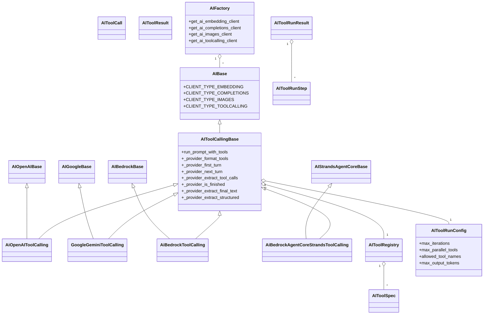
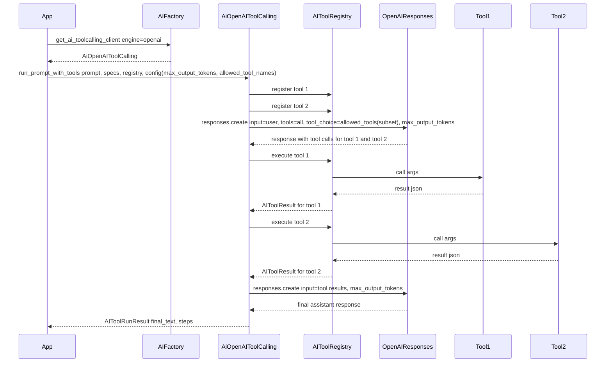
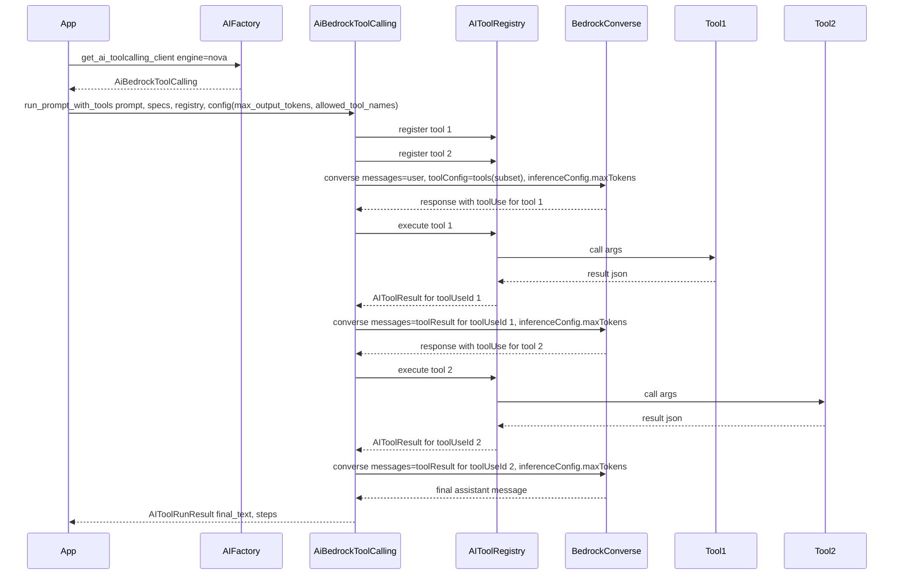

# AI API Tool Calling Abstraction Layer

## 1. Goals and Non-Goals

### 1.1 Goals

1. Add first-class **toolcalling support** to the AI API library that:

   - Works across:

     - OpenAI GPT-5.x / 5.2 via the **Responses API** with tools and custom tools.
     - Google Gemini via google-genai `client.models.generate_content` (REST: `models.generateContent`) with tools and function calling.
     - Amazon Bedrock via **Converse API tool use** (Nova and other models).
     - Amazon Bedrock AgentCore + **Strands Agents** as a separate agent-backend engine.

2. Expose **one unified abstraction**:

   - A common way to define tools (`AIToolSpec`).
   - A common representation of tool calls/results (`AIToolCall`, `AIToolResult`).
   - A single orchestration entrypoint on toolcalling clients:

     - `run_prompt_with_tools(...)` on an **`AIToolCallingBase`** subclass.

3. Preserve the library's existing patterns:

   - Vendor base classes: `AIOpenAIBase`, `AIGoogleBase`, `AIBedrockBase`, and a new `AIStrandsAgentCoreBase`.
   - `AIFactory` as the central creator.
   - Pydantic-based models for configuration and structured semantics (matching the existing completions layer).

4. Make strong, intentional vendor choices:

   - **OpenAI:** Always use **Responses API** for toolcalling with GPT-5.x/5.2.
   - **Gemini:** Always use google-genai `client.models.generate_content` (REST: `models.generateContent`) with tools and function calling.
   - **Bedrock:** Always use **Converse API** with `toolConfig`.
   - **AgentCore + Strands:** Treat the agent as a **single tool-aware endpoint**; it orchestrates its own tools internally.

5. Add **per-run control knobs** that work across vendors:

   - A **per-run tool allowlist**:

     - `allowed_tool_names: list[str] | None` in `AIToolRunConfig` that constrains _which tools_ are available for a given run.
     - Mapped to OpenAI Responses `tool_choice` with `type: "allowed_tools"` (OpenAI SDK >= 1.109.0); mapped to filtered tool lists for Gemini and Bedrock; mapped to hints for AgentCore.

   - A **per-run response token limit**:

     - `max_output_tokens: int | None` in `AIToolRunConfig`.
     - Mapped to each provider's output-length parameter:

       - OpenAI (Responses API): `max_output_tokens`.
       - Gemini (google-genai): `GenerateContentConfig.max_output_tokens` (REST: `generationConfig.maxOutputTokens`).
       - Bedrock Converse: `inferenceConfig.maxTokens`.

### 1.2 Non-Goals

- Do **not** merge completions and toolcalling into a single client class.
- Do **not** introduce multiple high-level "modes" for toolcalling (e.g., separate "simple" vs "advanced" flows).
- Do **not** attempt to expose all vendor-specific extras in v1 (Gemini JSON mode, OpenAI computer-use tools, Bedrock guardrails etc.) beyond what is needed for robust toolcalling and response-length limiting.

---

## 2. Vendor Capability Survey

### 2.1 OpenAI GPT-5.x / 5.2 toolcalling

**Responses API**

- We implement OpenAI toolcalling via the Responses API (`client.responses.create`).
- Minimum OpenAI Python SDK:
  - Use OpenAI SDK >= 1.109.0 for `tool_choice.type="allowed_tools"` and `tools.type="custom"` support.

**Tool declaration**

- Function tools (JSON schema) are passed in `tools` as flattened objects:
  - `{"type": "function", "name": "...", "description": "...", "parameters": {...}, "strict": true}`
- Custom tools (freeform payloads) are passed in `tools` as:
  - `{"type": "custom", "name": "...", "description": "...", "format": {"type": "text"}}`
  - Optional grammar constraint:
    - `{"format": {"type": "grammar", "syntax": "lark" | "regex", "definition": "..."}}`
  - Note: per OpenAI cookbook guidance, custom tools do not support parallel tool calling; set `parallel_tool_calls=false` when any `type="custom"` tool is present.

**Tool call objects emitted by the model**

- Function tool calls appear in `response.output` as items of `type: "function_call"` with:
  - `call_id: str`
  - `name: str`
  - `arguments: str` (JSON string)
- Custom tool calls appear in `response.output` as items of `type: "custom_tool_call"` with:
  - `call_id: str`
  - `name: str`
  - `input: str` (raw text, optionally grammar constrained)

**Tool result injection**

- To continue the loop, the client appends tool outputs as new input items in the next `responses.create` call:
  - Function tool result input item:
    - `{"type": "function_call_output", "call_id": "<call_id>", "output": "<json string>"}`
  - Custom tool result input item:
    - `{"type": "custom_tool_call_output", "call_id": "<call_id>", "output": "<string>"}`
- In this library, we standardize tool outputs as JSON objects (see `AIToolResult.output`) and send them to OpenAI as `json.dumps(...)` strings for both function and custom tool outputs.

**Tool choice and allowlisting**

- Responses supports allowlisting via `tool_choice.type="allowed_tools"`:
  - `tool_choice = {"type": "allowed_tools", "mode": "auto" | "required", "tools": [{"type": "function", "name": "tool_a"}, {"type": "custom", "name": "tool_b"}]}`
- This is used to enforce `AIToolRunConfig.allowed_tool_names` without removing tools from the `tools` list (helpful for prompt caching).

**Response length control**

- Responses uses `max_output_tokens` to cap generated tokens for the response.

---

### 2.2 Google Gemini toolcalling

**Function calling**

- Gemini exposes function calling via `function_declarations` within `types.Tool` objects passed via `types.GenerateContentConfig(tools=[...])` (google-genai SDK).

- Each function includes:

  - `name`, `description`, and a `parameters` JSON schema compatible with OpenAPI-style schemas.

**Interaction model**

- Request:

  - Send `contents` (string or `list[types.Content]`) with a tools-enabled `config` to `client.models.generate_content(...)`.
  - Our library performs manual tool orchestration (do not rely on the SDK auto-calling Python functions as tools).

- Response:

  - `response.candidates[0].content.parts` may include one or more parts where `part.function_call` is present.
  - Each `function_call` includes:
    - `name: str`
    - `args: dict[str, object]` (already parsed; no JSON string round-trip)
  - Gemini does not provide a stable call id; ordering is the disambiguation mechanism when multiple calls are present (including repeated calls to the same function name).

- Follow-up:

  - Execute requested functions and send a follow-up `generate_content` call that appends:
    - The model's prior `content` (the function call request).
    - A `role="user"` `types.Content` whose parts contain one `types.Part.from_function_response(...)` per tool call, in the same order as the tool calls.
  - Repeat until the model returns final text with no further `function_call` parts.

**Response length control**

- Gemini uses `GenerateContentConfig.max_output_tokens` (REST: `generationConfig.maxOutputTokens`) to cap the length of generated output.

**Key strengths to exploit**

- JSON-schema function calling semantics similar to OpenAI/Bedrock.
- Strong alignment with OpenAPI-style schemas and multiple client libraries (JS/Python/Vertex) with consistent `GenerationConfig` semantics.

---

### 2.3 Amazon Bedrock Converse tool use

**Converse API and tool use**

- The **Converse API** is the unified Bedrock entrypoint for chat and function-calling (tool use).

**Tool definition**

- Tools are defined via `toolConfig.tools` as `ToolSpec` objects:

  - `toolSpec.name`, `description`, and `inputSchema.json` carrying a JSON schema of the tool's arguments.

**ToolChoice**

- `toolConfig.toolChoice` can control how tools are used, including:

  - Automatic selection: `{"auto": {}}` (default).
  - Require at least one tool call: `{"any": {}}` (no text is generated).
  - Force a specific tool: `{"tool": {"name": "<tool_name>"}}` (supported by Anthropic Claude 3 and Amazon Nova).

**Tool use semantics**

- When the model decides to call a tool:

  - The Converse response contains `toolUse` content with fields like:

    - `toolUseId`, `name`, and `input` (arguments).

  - `stopReason` is set to `tool_use`.

- The client:

  - Executes the tool.
  - Sends a follow-up `converse` call with `toolResult` content referencing the same `toolUseId` and including the tool output.
  - Repeats until `stopReason` indicates completion and no more `toolUse` blocks appear.

**Response length control**

- Response length is controlled via `inferenceConfig.maxTokens`, which caps the number of tokens generated for the response.

**Key strengths to exploit**

- Strong JSON-schema-based tool definitions consistent with our internal model.
- Clear `stopReason` semantics and well-documented examples.
- Unified `maxTokens` configuration across models via `inferenceConfig`.

---

### 2.4 Bedrock AgentCore + Strands Agents

**AgentCore Runtime**

- Amazon Bedrock AgentCore runtime can host agents and tools built with frameworks like **Strands Agents** and others (LangGraph, MCP, etc.).
- It offers:

  - Agent orchestration, state, streaming, and observability.
  - Integration with tool backends (MCP servers, Bedrock models, external APIs).
  - Two common invocation patterns:
    - IAM SigV4 (AWS SDK / boto3): use `boto3.client("bedrock-agentcore").invoke_agent_runtime(...)`.
    - OAuth / bearer token: call the AgentCore HTTPS endpoint directly (boto3 does not support bearer token invocation).

**Strands Agents**

- Strands Agents define tools using decorators and type hints or JSON schema, which naturally maps to our `AIToolSpec` concept, but **those tools are owned by the agent**, not by our client.

**Key choice**

- For engines like `"agentcore-strands"`:

  - The **agent is the tool orchestrator**.
  - Our library treats this as a single tool-aware endpoint that already handles function calling internally.
  - We expose a dedicated `AiBedrockAgentCoreStrandsToolCalling` client that _conforms_ to the `AIToolCallingBase` interface but largely bypasses our own tool registry (or uses it only for input shaping / hints).

**Invocation shape (AgentCore Runtime)**

- IAM SigV4 via boto3:
  - Call `invoke_agent_runtime(agentRuntimeArn=..., payload=b"...", contentType="application/json", accept="text/event-stream" | "application/json", runtimeSessionId=..., qualifier=...)`.
  - The payload is application-defined; for Strands agent examples it is typically JSON like `{"prompt": "<text>"}` encoded to bytes.
- OAuth / bearer token via HTTPS:
  - POST `https://bedrock-agentcore.<region>.amazonaws.com/runtimes/<urlencoded_agent_arn>/invocations?qualifier=<QUALIFIER>`
  - Headers commonly used:
    - `Authorization: Bearer <TOKEN>`
    - `Content-Type: application/json`
    - `X-Amzn-Bedrock-AgentCore-Runtime-Session-Id: <session_id>`
    - Optional tracing: `X-Amzn-Trace-Id: <trace_id>`
  - Body is the JSON payload (for example `{"prompt": "..."}`).

---

## 3. Cross-Vendor Compare and Contrast

| Dimension                        | OpenAI GPT-5.x/5.2 + Responses                                                                 | Gemini (google-genai)                                                                 | Bedrock Converse                                                                 | AgentCore + Strands                                                                 |
| -------------------------------- | ---------------------------------------------------------------------------------------------- | ------------------------------------------------------------------------------------ | ------------------------------------------------------------------------------ | --------------------------------------------------------------------------------- |
| Tool declaration                 | `tools` list with `type="function"` (`parameters`) and `type="custom"` (`format`) ([1][5])     | `types.Tool(function_declarations=[...])` in `GenerateContentConfig.tools` ([2])    | `toolConfig.tools` with `toolSpec.inputSchema.json` ([3])                      | Tools declared in the agent; request is agent payload ([11][12])                  |
| Tool call object                 | `function_call` (JSON string args) and `custom_tool_call` (raw text input) items ([1][5])      | `part.function_call` with `name` + parsed `args` (no call id; order matters) ([2])  | `toolUse` blocks with `toolUseId`, `name`, `input` ([3])                       | Internal to agent orchestration (not exposed as structured tool calls)            |
| Tool result injection            | Input items `function_call_output` and `custom_tool_call_output` keyed by `call_id` ([1])      | `types.Part.from_function_response(name=..., response=...)` appended to `contents` ([2]) | `toolResult` blocks keyed by `toolUseId` (content can be `json` or `text`) ([3]) | Opaque; our client only sends prompts/hints                                      |
| Tool choice / forcing            | `tool_choice` supports `auto|required|none` and `type="allowed_tools"` subsets ([1])           | Filter tool declarations; optional `functionCallingConfig` behaviors ([2])           | `toolConfig.toolChoice`: `auto`, `any`, or `tool` (specific tool) ([3])        | Agent decides internally; we can only hint                                       |
| Free-form tool payloads          | Custom tools accept raw text input; optional grammar constraints via `format` ([5])            | Emulate freeform via a JSON schema with a single `payload: string` field ([2])       | Emulate freeform via a JSON schema with a single `payload: string` field ([3]) | Framework-defined                                                                |
| Recommended interface            | Responses API (`responses.create`) ([1])                                                       | `client.models.generate_content` ([2][7])                                            | `bedrock-runtime:converse` ([3][9])                                            | `InvokeAgentRuntime` via boto3 or HTTPS ([12][13])                               |
| Per-run tool allowlist (library) | Map `allowed_tool_names` to `tool_choice.type="allowed_tools"` (or filter tools if needed)     | Filter `function_declarations` to the allowed subset                                 | Filter `toolConfig.tools` to the allowed subset                                 | Encode allowlist as prompt guidance                                              |
| Response token limit (library)   | Map `max_output_tokens` to Responses `max_output_tokens`                                        | Map `max_output_tokens` to `GenerateContentConfig.max_output_tokens`                  | Map `max_output_tokens` to `inferenceConfig.maxTokens`                          | No portable hard cap; use prompt guidance                                        |

[1]: https://platform.openai.com/docs/guides/function-calling
[2]: https://ai.google.dev/gemini-api/docs/function-calling
[3]: https://docs.aws.amazon.com/bedrock/latest/userguide/tool-use-inference-call.html
[4]: https://strandsagents.com/latest/documentation/docs/user-guide/deploy/deploy_to_bedrock_agentcore/
[5]: https://cookbook.openai.com/examples/gpt-5/gpt-5_new_params_and_tools
[6]: https://github.com/openai/openai-cookbook/blob/main/examples/gpt-5/gpt-5_new_params_and_tools.ipynb
[7]: https://ai.google.dev/api/generate-content
[8]: https://docs.aws.amazon.com/bedrock/latest/userguide/tool-use-examples.html
[9]: https://boto3.amazonaws.com/v1/documentation/api/latest/reference/services/bedrock-runtime/client/converse.html
[10]: https://aws-samples.github.io/amazon-bedrock-samples/agents-and-function-calling/function-calling/function_calling_with_converse/function_calling_with_converse/
[11]: https://docs.aws.amazon.com/bedrock-agentcore/latest/devguide/agents-tools-runtime.html
[12]: https://docs.aws.amazon.com/bedrock-agentcore/latest/devguide/runtime-invoke-agent.html
[13]: https://docs.aws.amazon.com/bedrock-agentcore/latest/devguide/runtime-oauth.html

---

## 4. Library Design Overview

### 4.1 New client type

Extend `AIBase` with a new client type constant:

- `CLIENT_TYPE_TOOLCALLING = "toolcalling"`

Existing:

- `CLIENT_TYPE_EMBEDDING`
- `CLIENT_TYPE_COMPLETIONS`
- `CLIENT_TYPE_IMAGES`

### 4.2 Separation of responsibilities

- **Completions path** (existing):

  - `AIBaseCompletions` plus `AiOpenAICompletions`, `GoogleGeminiCompletions`, `AiBedrockCompletions`.
  - Responsible for normal text/multimodal generation and structured outputs, but **no tool orchestration**.

- **Toolcalling path** (new):

  - `AIToolCallingBase` plus vendor-specific subclasses.
  - Responsible for multi-step tool loops, argument parsing, and result reinjection.
  - Shares vendor base classes:

    - `AiOpenAIToolCalling(AIOpenAIBase, AIToolCallingBase)`
    - `GoogleGeminiToolCalling(AIGoogleBase, AIToolCallingBase)`
    - `AiBedrockToolCalling(AIBedrockBase, AIToolCallingBase)`
    - `AiBedrockAgentCoreStrandsToolCalling(AIStrandsAgentCoreBase, AIToolCallingBase)`

---

## 5. Shared Toolcalling Domain Model

All of this lives in a new module, e.g., `ai_tool_calling_base.py`, aligned with existing style from `ai_base.py` and `ai_*_completions.py`.

### 5.1 AIToolSpec

Represents a tool the model can call.

Fields:

- `name: str`

  - Unique within a registry.
  - Cross-vendor safety constraint (recommended):
    - Match regex `[a-zA-Z0-9_-]+` and length `1..64` to satisfy OpenAI/Bedrock naming rules.

- `description: str`

  - Human-readable; fed into vendor tool declarations.

- `json_schema: dict[str, object]`

  - JSON schema for arguments.
  - Must be compatible with:

    - OpenAI Responses function tools (`parameters`).
    - Gemini `function_declarations.parameters`.
    - Bedrock `ToolSpec.inputSchema.json`.

- `input_mode: str` (enum in code)

  - `"json_schema"`:

    - Strict JSON arguments derived from `json_schema`.

  - `"freeform"`:

    - For OpenAI GPT-5 custom tools / freeform toolcalling (raw text payloads).
    - For Gemini/Bedrock, encoded as JSON with a single required string field `payload` to keep a consistent tool signature:

      ```json
      {
        "type": "object",
        "properties": { "payload": { "type": "string" } },
        "required": ["payload"],
        "additionalProperties": false
      }
      ```

- `vendor_overrides: dict[str, dict[str, object]]`

  - Optional; keyed by `"openai"`, `"google-gemini"`, `"bedrock"`, `"agentcore-strands"`.
  - Used for vendor-specific metadata such as:

    - OpenAI custom tool input constraints:
      - `{"format": {"type": "text"}}` (default) or `{"format": {"type": "grammar", "syntax": "lark" | "regex", "definition": "..."}}`.
    - Gemini built-in tools config (search, code execution).
    - Bedrock model or tool-specific hints.

- `timeout_seconds: int | None`

  - Suggested maximum runtime for this tool; used by `AIToolRegistry` when scheduling calls.

### 5.2 AIToolCall

Represents a single tool call emitted by a model.

Fields:

- `call_id: str`

  - OpenAI: tool call id.
  - Gemini: synthetic id based on part index.
  - Bedrock: `toolUseId`.

- `tool_name: str`
- `arguments: dict[str, object] | str`

  - Parsed JSON for JSON-schema tools.
  - Raw text payload for freeform tools if needed.

- `raw_vendor_call: dict[str, object]`

  - Unmodified vendor payload for debugging/tracing.

### 5.3 AIToolResult

Represents execution result for a tool call.

Fields:

- `call_id: str`
- `tool_name: str`
- `output: dict[str, object]`

  - JSON-serializable representation of the output.
  - Standard envelope (required):

    - Success:
      - `{"ok": true, "result": <any JSON-serializable value>}`
    - Error:
      - `{"ok": false, "error": {"type": "<string>", "message": "<string>", "detail": <any JSON-serializable value>}}`

- `is_error: bool`
- `error_message: str | None`

  - For validation or runtime errors; also included in `output` so models can handle failure cases.
  - `is_error` MUST be consistent with `output["ok"]` (i.e., `is_error == (output["ok"] is False)`).

### 5.4 AIToolRegistry

Handles tool registration, validation, and execution.

Responsibilities:

1. **Registration**

   - Store a mapping: `tool_name -> (AIToolSpec, callable)`.

2. **Validation**

   - Validate incoming `AIToolCall.arguments` against `AIToolSpec.json_schema` when `input_mode=="json_schema"`.
   - On validation failure:

     - Do not execute callable.
     - Return an `AIToolResult` with `is_error=True` and `output` describing the validation error.

3. **Execution**

   - Execute tools:

     - Serially by default.
     - Use threads or async tasks up to `max_parallel_tools` to support multiple tool calls per step.
     - Preserve ordering: `AIToolRegistry.execute(...)` MUST return results in the same order as the input `tool_calls` list (even when executed concurrently). This is required to safely round-trip repeated Gemini function calls (no vendor call id).

   - Catch all exceptions and convert to `AIToolResult` with `is_error=True` and a reasonable error payload.
   - Enforce per-tool timeouts:
     - If `AIToolSpec.timeout_seconds` is set and the tool does not complete within the timeout, return an error `AIToolResult` with `error.type="timeout"`.

### 5.5 AIToolRunConfig

Controls behavior of the toolcalling loop.

Fields:

- `max_iterations: int`

  - Upper bound for model <-> tools iterations per `run_prompt_with_tools` call.
  - Default: `10`.

- `max_parallel_tools: int`

  - Maximum concurrent tool executions per loop iteration.
  - Default: `4`.

- `allowed_tool_names: list[str] | None`

  - If `None`:

    - All registered tools are eligible by default.

  - If empty (`[]`):

    - No tools are exposed; tool use is effectively disabled for this run.

  - If non-empty:

    - Only tools whose `AIToolSpec.name` appears in this list are **exposed to the model** for this run.
    - If any entry is not found in the provided tool specs / registry, raise a `ValueError` before the first provider call (misconfiguration).

  - Vendor behavior:

    - **OpenAI GPT-5.x/5.2:** map to `tool_choice.type="allowed_tools"` and include only the subset in `tool_choice.tools` (keep the full `tools` list when possible).
    - **Gemini:** build tool declarations only from the allowed subset.
    - **Bedrock Converse:** build `toolConfig.tools` only from the allowed subset.
    - **AgentCore + Strands:** embed the allowed tool names in the agent prompt as guidance; enforcement is agent-internal.

- `max_output_tokens: int | None`

  - If `None`: the provider uses its default output-length behavior.
  - If set:

    - **OpenAI (Responses API):** mapped to `max_output_tokens`.
    - **Gemini:** mapped to `GenerateContentConfig.max_output_tokens`.
    - **Bedrock Converse:** mapped to `inferenceConfig.maxTokens`.
    - **AgentCore + Strands:** no portable hard cap; included as a modeling hint in the agent prompt.

This keeps the design unified: a single `AIToolRunConfig` structure governs both **which tools** and **how long responses can be**, with no additional modes.

### 5.6 AIToolRunStep

Represents one iteration within the tool loop.

Fields:

- `step_index: int`
- `tool_calls: list[AIToolCall]`
- `tool_results: list[AIToolResult]`
- `model_message_excerpt: str`

  - Small excerpt of the assistant's message for logging/observability.

### 5.7 AIToolRunResult

Return type of `run_prompt_with_tools`.

Fields:

- `final_text: str`
- `final_structured: dict[str, object] | None`

  - Optional structured payload if the model is instructed to return JSON.

- `steps: list[AIToolRunStep]`
- `raw_vendor_transcript: list[dict[str, object]]`

  - Optional; full vendor message transcript for debugging/audit.

---

## 6. AIToolCallingBase

`AIToolCallingBase` is an abstract base class (subclass of `AIBase`) that owns the **toolcalling loop** and delegates vendor-specific details to hooks.

### 6.1 Inheritance

```text
AIBase
  `-- AIToolCallingBase
```

### 6.2 Abstract provider hooks

Each vendor subclass implements:

- `_provider_format_tools(self, specs: list[AIToolSpec], config: AIToolRunConfig) -> dict[str, object]`

  - Convert our tool specs plus `config.allowed_tool_names` into vendor tool structures:

    - OpenAI: `tools` plus `tool_choice`.
    - Gemini: `types.Tool` list for `GenerateContentConfig(tools=[...])`.
    - Bedrock: `toolConfig` with `tools` and `toolChoice`.
    - AgentCore + Strands: typically a no-op or used only for hints.

- `_provider_first_turn(self, prompt: str, formatted_tools: dict[str, object], config: AIToolRunConfig) -> dict[str, object]`

  - Execute the first LLM/agent call with tools and token limits applied.

- `_provider_extract_tool_calls(self, response: dict[str, object]) -> list[AIToolCall]`

  - Parse tool calls out of the vendor response.

- `_provider_next_turn(self, last_response: dict[str, object], tool_results: list[AIToolResult], config: AIToolRunConfig) -> dict[str, object]`

  - Execute a subsequent LLM call, injecting tool results.

- `_provider_is_finished(self, response: dict[str, object]) -> bool`

  - Return true when there are no further tool calls and vendor stop/completion reasons indicate a final answer.

- `_provider_extract_final_text(self, response: dict[str, object]) -> str`

- `_provider_extract_structured(self, response: dict[str, object]) -> dict[str, object] | None`

### 6.3 Orchestration method

`run_prompt_with_tools(self, prompt: str, specs: list[AIToolSpec], registry: AIToolRegistry, config: AIToolRunConfig) -> AIToolRunResult`

Algorithm (single, non-optional flow):

1. Call `_provider_format_tools(specs, config)` to produce vendor-specific tool payloads, honoring `config.allowed_tool_names`.

2. Call `_provider_first_turn(prompt, formatted_tools, config)` to obtain the first model response (with `config.max_output_tokens` applied).

3. Initialize an empty list of `AIToolRunStep` and a vendor transcript accumulator.

4. For `iteration` from `0` to `config.max_iterations - 1`:

   - Use `_provider_extract_tool_calls` to identify tool calls.

   - If no tool calls:

     - If `_provider_is_finished(response)`:

       - Extract `final_text` and `final_structured`.
       - Return `AIToolRunResult` with all collected steps and transcript.

     - Otherwise:

       - Treat as a protocol error and return an `AIToolRunResult` with `final_text` indicating unexpected state.

   - If there are tool calls:

     - For each `AIToolCall`, use `AIToolRegistry` to validate and execute, honoring `config.max_parallel_tools`.

     - Record an `AIToolRunStep` with calls and results.

     - Call `_provider_next_turn(last_response, tool_results, config)` to get the next response, again with `max_output_tokens` applied.

5. If the loop reaches `config.max_iterations` without finishing:

   - Return an `AIToolRunResult` whose `final_text` explains that the maximum iteration limit was reached.

This keeps control flow uniform for all engines; only the provider-specific hooks differ.

---

## 7. Vendor Toolcalling Clients

Each vendor toolcalling client uses **multiple inheritance** with the vendor base and `AIToolCallingBase`.

- `AiOpenAIToolCalling(AIOpenAIBase, AIToolCallingBase)`
- `GoogleGeminiToolCalling(AIGoogleBase, AIToolCallingBase)`
- `AiBedrockToolCalling(AIBedrockBase, AIToolCallingBase)`
- `AiBedrockAgentCoreStrandsToolCalling(AIStrandsAgentCoreBase, AIToolCallingBase)`

### 7.1 AiOpenAIToolCalling

**Inheritance**

- `class AiOpenAIToolCalling(AIOpenAIBase, AIToolCallingBase):`

**Behavior**

- `client_type = AIBase.CLIENT_TYPE_TOOLCALLING`.
- Uses OpenAI **Responses API** with GPT-5.x / 5.2 models.

**Token length and tool allowlist**

- `config.max_output_tokens`:

  - Set the Responses token limit parameter `max_output_tokens`, constraining output length.

- `config.allowed_tool_names`:

  - Build a full `tools` list from all `AIToolSpec` objects.
  - Build `tool_choice` using `type: "allowed_tools"`:

    - `tool_choice = { "type": "allowed_tools", "mode": "auto", "tools": [{"type": "function", "name": "..."}, {"type": "custom", "name": "..."}] }`
    - Where `tools` is the subset corresponding to `allowed_tool_names`.

**Hook implementations**

- `_provider_format_tools`:

  - For each `AIToolSpec`:

    - If `input_mode=="json_schema"`:

      - Use `{"type": "function", "name": name, "description": description, "parameters": json_schema, "strict": true}`.

    - If `input_mode=="freeform"`:

      - Use the GPT-5 custom tool pattern: `{"type": "custom", "name": name, "description": description, "format": {"type": "text"}}` (optionally overridden via `vendor_overrides["openai"]["format"]`).

  - Build the `tool_choice`:
    - If `config.allowed_tool_names is None`: default to `"auto"`.
    - If `config.allowed_tool_names == []`: set `"none"` and do not provide tools.
    - If non-empty: set `{"type": "allowed_tools", "mode": "auto", "tools": [...]}`.
  - Set `parallel_tool_calls`:
    - `False` if any `type="custom"` tool is present.
    - Otherwise `True` when `config.max_parallel_tools > 1`.

- `_provider_first_turn`:

  - Use `AIOpenAIBase`'s configured OpenAI client to call `responses.create(...)` with:

    - Initial user input in `input`.
    - `tools` and `tool_choice`.
    - `max_output_tokens` (if set).

- `_provider_extract_tool_calls`:

  - Inspect the Responses output for tool calls; for each call, construct an `AIToolCall` with:

    - `call_id`, `tool_name`, and parsed arguments.

- `_provider_next_turn`:

  - Build the next `responses.create(...)` input by appending one output item per `AIToolResult`:
    - Function tools: `{"type": "function_call_output", "call_id": "<call_id>", "output": "<json string>"}`
    - Custom tools: `{"type": "custom_tool_call_output", "call_id": "<call_id>", "output": "<json string>"}`

- `_provider_is_finished`:

  - Return true when the response has no new tool calls and is marked as complete by the API.

- `_provider_extract_final_text` / `_provider_extract_structured`:

  - Extract the final message text and optional JSON payload.

---

### 7.2 GoogleGeminiToolCalling

**Inheritance**

- `class GoogleGeminiToolCalling(AIGoogleBase, AIToolCallingBase):`

**Behavior**

- `client_type = AIBase.CLIENT_TYPE_TOOLCALLING`.
- Uses google-genai `client.models.generate_content(...)` with tools and function calling.

**Token length and tool allowlist**

- `config.max_output_tokens`:

  - Mapped to `GenerateContentConfig.max_output_tokens` in the request.

- `config.allowed_tool_names`:

  - The `tools` passed in `GenerateContentConfig(tools=[...])` contain only the subset of `AIToolSpec` whose names appear in `allowed_tool_names`.
  - If `None`, the full set of specs is used.

**Hook implementations**

- `_provider_format_tools`:

  - Construct Gemini `types.Tool` objects with `function_declarations`:

    - `name`, `description`, and `parameters=json_schema`.

  - Apply `allowed_tool_names` by filtering the specs before building the `tools` list.

  - Optionally apply `vendor_overrides["google-gemini"]` for built-in tools (search, code execution) when present.

- `_provider_first_turn`:

  - Use `AIGoogleBase` client to call `generate_content` with:

    - `contents` representing the conversation.
    - `config=GenerateContentConfig(tools=..., max_output_tokens=...)` mapped from `config.max_output_tokens`.

- `_provider_extract_tool_calls`:

  - Parse `candidates[0].content.parts` for `part.function_call`; build `AIToolCall` entries.

- `_provider_next_turn`:

  - Call `generate_content` with prior content plus `types.Part.from_function_response(...)` parts representing each `AIToolResult` (preserve tool call ordering).

- `_provider_is_finished`:

  - True when there are no `function_call` parts and the candidate is complete.

- `_provider_extract_final_text` / `_provider_extract_structured`:

  - Extract final text and optional JSON payload from the last candidate.

---

### 7.3 AiBedrockToolCalling

**Inheritance**

- `class AiBedrockToolCalling(AIBedrockBase, AIToolCallingBase):`

**Behavior**

- `client_type = AIBase.CLIENT_TYPE_TOOLCALLING`.
- Uses **Bedrock Converse** API with `toolConfig` for function calling.

**Token length and tool allowlist**

- `config.max_output_tokens`:

  - Mapped to `inferenceConfig.maxTokens` in the Converse call.

- `config.allowed_tool_names`:

  - Build `toolConfig.tools` only from `AIToolSpec` entries whose names are in `allowed_tool_names`.
  - If `None`, include all specs.

**Hook implementations**

- `_provider_format_tools`:

  - Build a `toolConfig` dict:

    - `tools`: each `ToolSpec` with `toolSpec.name`, `description`, and `inputSchema.json` from `AIToolSpec.json_schema`.

    - `toolChoice`: default to `{"auto": {}}` for v1, aligning with Bedrock samples.

  - Filter specs by `allowed_tool_names` when set.

- `_provider_first_turn`:

  - Call `converse` via `AIBedrockBase` runtime client with:

    - `messages` containing the user input.
    - `toolConfig` from above.
    - `inferenceConfig.maxTokens` from `config.max_output_tokens` if set.

- `_provider_extract_tool_calls`:

  - Inspect the response messages for `toolUse` content blocks.
  - For each `toolUse`, emit an `AIToolCall` with `call_id=toolUseId`, `tool_name=name`, and `arguments=input`.

- `_provider_next_turn`:

  - Call `converse` again with messages including:

    - Prior conversation.
    - `toolResult` messages, each referencing the original `toolUseId` and containing a single `{"json": <AIToolResult.output>}` content item. If `AIToolResult.is_error` is true, set `toolResult.status="error"`.

- `_provider_is_finished`:

  - True when `stopReason` is not `tool_use` and there is an assistant message, meaning the model has produced a final response.

- `_provider_extract_final_text` / `_provider_extract_structured`:

  - Extract final text and optional JSON from the final assistant message.

---

### 7.4 AiBedrockAgentCoreStrandsToolCalling

**Base class**

Add `AIStrandsAgentCoreBase` in `ai_bedrock_agentcore_base.py`:

- Fields and configuration:

  - `agent_runtime_arn` from `AGENTCORE_AGENT_RUNTIME_ARN`.
  - `qualifier` from `AGENTCORE_QUALIFIER` (default `"DEFAULT"`).
  - `bearer_token` from `AGENTCORE_BEARER_TOKEN` (optional; enables HTTPS invocation mode).
  - `endpoint_url` from `AGENTCORE_ENDPOINT_URL` (optional; default derived from region, e.g. `https://bedrock-agentcore.us-east-1.amazonaws.com`).
  - `runtime_session_id` from `AGENTCORE_RUNTIME_SESSION_ID` (optional; if unset, generate per run).

- Responsibilities:

  - Provide a boto3 `bedrock-agentcore` client for IAM SigV4 invocation (default mode).
  - Provide an HTTP client for bearer token invocation (required for OAuth; boto3 does not support bearer token invocation).
  - Implement retry logic and error handling consistent with other vendor bases.

**Toolcalling client**

- `class AiBedrockAgentCoreStrandsToolCalling(AIStrandsAgentCoreBase, AIToolCallingBase):`

**Behavior**

- `client_type = AIBase.CLIENT_TYPE_TOOLCALLING`.
- Treats the Strands agent as a **single endpoint that already does tool orchestration**.

**Token length and tool allowlist**

- `config.max_output_tokens`:

  - No portable hard cap via AgentCore Runtime; encode desired length as a soft hint in the prompt.

- `config.allowed_tool_names`:

  - Since tools are defined inside the Strands agent, we cannot directly alter the tool set.
  - We embed the allowlist as guidance in the prompt (for example: "Only use the following tools: tool_1, tool_2").

**Hook implementations (simplified)**

- `_provider_format_tools`:

  - No-op; there is no direct tools payload to build.

- `_provider_first_turn`:

  - Build a single prompt string by prefixing the user prompt with a short "constraints" block:
    - Allowed tools hint (if provided).
    - Max output tokens hint (if provided).
  - Invoke the agent runtime:
    - If `AGENTCORE_BEARER_TOKEN` is set:
      - POST `${AGENTCORE_ENDPOINT_URL}/runtimes/<urlencoded_agent_runtime_arn>/invocations?qualifier=${AGENTCORE_QUALIFIER}`
      - Headers include `Authorization: Bearer ...`, `Content-Type: application/json`, and `X-Amzn-Bedrock-AgentCore-Runtime-Session-Id`.
    - Otherwise:
      - Call boto3 `invoke_agent_runtime(agentRuntimeArn=..., payload=..., contentType="application/json", accept=...)`.
  - Decode either `text/event-stream` or `application/json` responses into a single final text string for `AIToolRunResult.final_text`.

- `_provider_extract_tool_calls`:

  - Returns an empty list; the agent is responsible for actual tool calls.
  - This makes the loop effectively single-step.

- `_provider_next_turn`:

  - Typically not used in v1; the agent is expected to return a fully resolved answer.

- `_provider_is_finished`:

  - Always true after the first response for v1.

- `_provider_extract_final_text` / `_provider_extract_structured`:

  - Extract the agent's final reply and optional structured payload.

This lets us keep a single `AIToolCallingBase` interface, even for agent-backed flows, without introducing alternative modes.

---

## 8. Env Vars and Factory Integration

### 8.1 New environment variables

Extend `env_template`:

```text
########################################################################
#   TOOLCALLING ENGINE & MODEL
########################################################################
# Which provider family to use for tool calling:
#   openai | google-gemini | nova | llama | anthropic | mistral | cohere | ai21 | rerank | canvas | agentcore-strands
TOOLCALLING_ENGINE=openai

# Default model name for tool calling.
#   For openai: gpt-5.2 or similar
#   For google-gemini: gemini-3-pro or similar
#   For nova or other bedrock models: model id, e.g. amazon.nova-pro-v1:0
#   For agentcore-strands: optional, agent may choose underlying model.
TOOLCALLING_MODEL_NAME=

########################################################################
#   AGENTCORE + STRANDS SETTINGS
########################################################################
# Agent runtime ARN (required). This is passed as agentRuntimeArn to InvokeAgentRuntime.
AGENTCORE_AGENT_RUNTIME_ARN=

# Optional qualifier (version/endpoint pointer). Default: DEFAULT
AGENTCORE_QUALIFIER=DEFAULT

# Optional override for the AgentCore endpoint base URL.
# Example: https://bedrock-agentcore.us-east-1.amazonaws.com
AGENTCORE_ENDPOINT_URL=

# Optional bearer token for OAuth invocation mode. If set, the library invokes
# AgentCore via HTTPS with Authorization: Bearer <token> instead of boto3.
AGENTCORE_BEARER_TOKEN=

# Optional runtime session id to preserve agent state across calls.
AGENTCORE_RUNTIME_SESSION_ID=
```

Existing env vars (OpenAI keys, Bedrock region, Gemini key, completions engine/model) remain unchanged.

### 8.2 AIFactory

Add a `get_ai_toolcalling_client` method to `AIFactory`:

```python
def get_ai_toolcalling_client(
    model_name: str | None = None,
    toolcalling_engine: str | None = None,
) -> AIToolCallingBase:
    ...
```

Resolution logic:

1. **Engine**

   - If `toolcalling_engine` is provided, normalize and use it.
   - Else read `TOOLCALLING_ENGINE` (default `"openai"`), normalize, and use it.

2. **Model name**

   - If `model_name` is provided, use it.
   - Else read `TOOLCALLING_MODEL_NAME`; if empty, fall back to `COMPLETIONS_MODEL_NAME`.

3. **Dispatch**

   - `"openai"` -> `AiOpenAIToolCalling(model=model_name)`

   - `"google-gemini"`:

     - Require Gemini extras to be installed, else raise a runtime error mirroring the completions layer.
     - Return `GoogleGeminiToolCalling(model=model_name)`.

   - Bedrock-family engines (`"nova"`, `"llama"`, `"anthropic"`, `"mistral"`, `"cohere"`, `"ai21"`, `"rerank"`, `"canvas"`):

     - Require Bedrock extras; else raise a consistent runtime error.
     - Return `AiBedrockToolCalling(model=model_name)`.

   - `"agentcore-strands"`:

     - Return `AiBedrockAgentCoreStrandsToolCalling(model=model_name)`.

This matches the pattern of `get_ai_completions_client`, so developers get a consistent factory experience.

#### Bedrock Toolcalling Creation Guardrail

Validate the configured model_id against a curated set of known tool-use-capable model id prefixes (for example Nova, Claude 3/4, Jamba 1.5, Command R/R+, Mistral Large/Small, Llama tool-ready variants, etc.).

Implementation notes:

- Source of truth: `src/ai_api_unified/util/bedrock_tool_use_model_allowlist.py`
  - Define `BEDROCK_TOOL_USE_MODEL_ID_PREFIXES: tuple[str, ...]` and keep it updated as Bedrock adds models.
- Failure behavior:
  - If the configured `model_id` does not match any known tool-use-capable prefix, raise `AIModelToolUseNotSupportedError`.
  - Error message should include:
    - The rejected `model_id`.
    - A short hint to pick a tool-use-capable Bedrock model id (or switch `TOOLCALLING_ENGINE`).
    - The allowlist file path so maintainers can update it.

---

## 9. Mermaid Class Diagram



---

## 10. Sequence Diagrams (End-to-End Scenarios)

### 10.1 OpenAI GPT-5.2 multi-tool flow via Responses



### 10.2 Bedrock Converse multi-step tool flow



---

## 11. Implementation Task Outline

This is the concrete breakdown you can feed into your Codex task list.

1. **Core toolcalling infrastructure**

   - Add `CLIENT_TYPE_TOOLCALLING` to `AIBase`.
   - Create `ai_tool_calling_base.py`:

     - Implement `AIToolSpec`, `AIToolCall`, `AIToolResult`, `AIToolRegistry`, `AIToolRunConfig` (including `allowed_tool_names`, `max_output_tokens`), `AIToolRunStep`, `AIToolRunResult`, and `AIToolCallingBase`.

2. **OpenAI toolcalling**

   - Add `ai_openai_tool_calling.py`:

     - `AiOpenAIToolCalling(AIOpenAIBase, AIToolCallingBase)`.
     - Implement all provider hooks using the Responses API, including:

       - Mapping `allowed_tool_names` to `tool_choice` with `allowed_tools`.
       - Mapping `max_output_tokens` to Responses output-length controls.
       - Supporting `type="custom"` tools for `input_mode="freeform"`, including `custom_tool_call_output` reinjection and disabling `parallel_tool_calls`.

3. **Gemini toolcalling**

   - Add `ai_google_gemini_tool_calling.py`:

     - `GoogleGeminiToolCalling(AIGoogleBase, AIToolCallingBase)`.
     - Implement hooks using google-genai `client.models.generate_content`:

       - `tools` built from filtered `AIToolSpec` based on `allowed_tool_names`.
       - `GenerateContentConfig.max_output_tokens` from `max_output_tokens`.

4. **Bedrock Converse toolcalling**

   - Add `ai_bedrock_tool_calling.py`:

     - `AiBedrockToolCalling(AIBedrockBase, AIToolCallingBase)`.
     - Implement hooks using Converse:

       - `toolConfig.tools` filtered by `allowed_tool_names`.
       - `inferenceConfig.maxTokens` from `max_output_tokens`.
       - `toolUse` / `toolResult` handling for multi-step flows.

5. **Bedrock AgentCore + Strands**

   - Add `ai_bedrock_agentcore_base.py`:

     - `AIStrandsAgentCoreBase` with `AGENTCORE_AGENT_RUNTIME_ARN` and optional `AGENTCORE_BEARER_TOKEN` / `AGENTCORE_ENDPOINT_URL` / `AGENTCORE_QUALIFIER` / `AGENTCORE_RUNTIME_SESSION_ID`.

   - Add `ai_bedrock_agentcore_strands_tool_calling.py`:

     - `AiBedrockAgentCoreStrandsToolCalling(AIStrandsAgentCoreBase, AIToolCallingBase)`:

       - Single-shot agent call implementing the same `run_prompt_with_tools` interface.
       - Use `allowed_tool_names` and `max_output_tokens` as hints in the agent request.

6. **Factory and env integration**

   - Update `env_template` with `TOOLCALLING_ENGINE`, `TOOLCALLING_MODEL_NAME`, `AGENTCORE_AGENT_RUNTIME_ARN`, `AGENTCORE_QUALIFIER`, `AGENTCORE_ENDPOINT_URL`, `AGENTCORE_BEARER_TOKEN`, `AGENTCORE_RUNTIME_SESSION_ID`.
   - Add `get_ai_toolcalling_client` to `AIFactory` with engine/model resolution consistent with completions.

7. **Tests**

   - Unit tests for `AIToolRegistry`:

     - Registration, JSON-schema validation, error handling, and exception capture.

   - Provider-specific tests (mocked):

     - OpenAI: tool calls round trip via Responses.
     - Gemini: `functionCall` -> `functionResponse` loop.
     - Bedrock: `toolUse` -> `toolResult` loop.

   - A thin integration test that uses real or mocked clients to ensure `allowed_tool_names` and `max_output_tokens` are wired into vendor payloads as designed.
